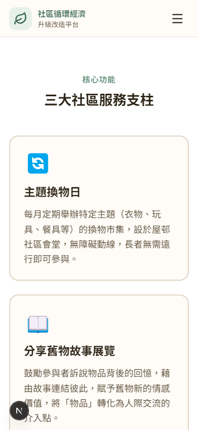
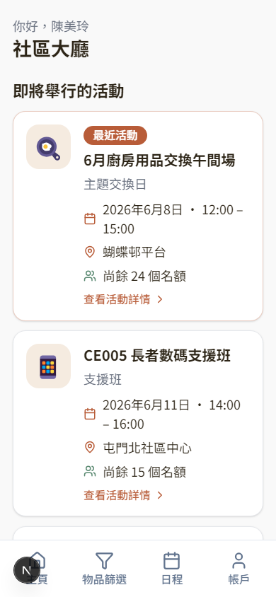
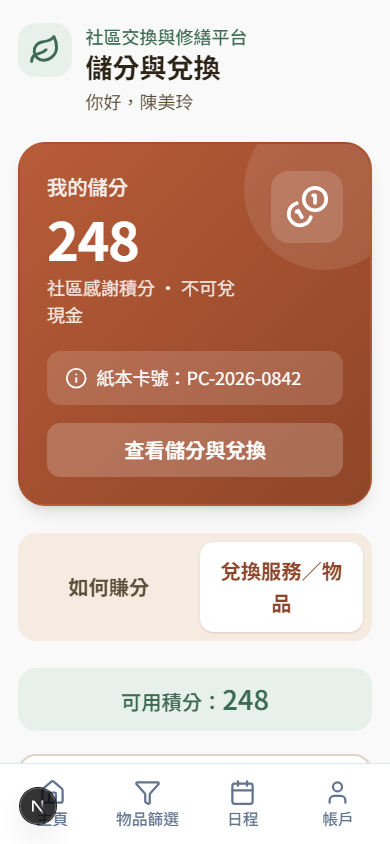
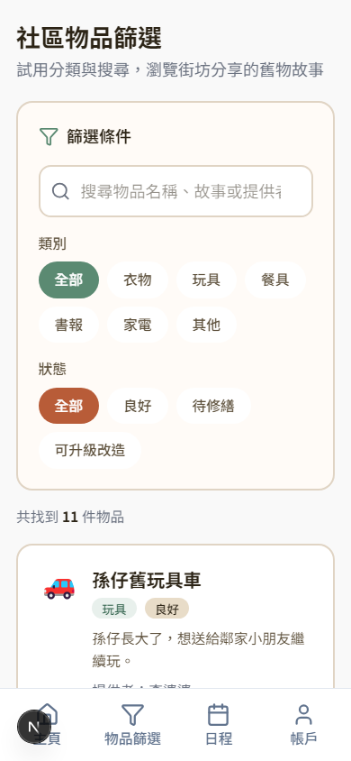
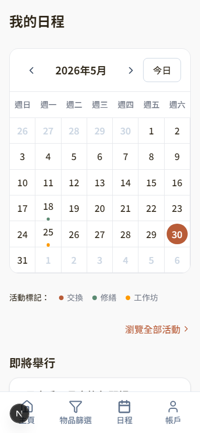
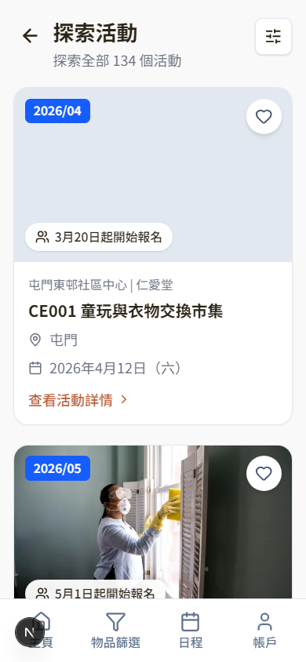

# 社區換物carousell

本計畫透過在社區舉辦換物市集與設置維修平台服務，推動閒置資源的循環利用，並深化街坊間的交流。本計畫特別關注社區內的長者群體——許多長者基於惜物情懷，往往會保留「修好還能用」或覺得「總有一天會用到」的老物件；然而，受限於行動不便，他們難以將物品帶至區外維修或妥善棄置，長期下來容易演變成居家空間的物品囤積。因此，本計畫期望以換物市集為切入點，發掘這些閒置舊物的新價值。這不僅能協助長者減輕囤積狀況，更能藉由資源交換的過程凝聚社會力量，重新編織長者的社區支援網絡，從根本上改善他們的生活品質

## App 預覽

<p align="center">
  
  
</p>

<p align="center">
  
  
</p>

<p align="center">
  
  
</p>

## 快速開始

```bash
cd web
npm install
npm run dev
```

瀏覽 [http://localhost:3000](http://localhost:3000)（若埠號被佔用，終端機會顯示實際埠號，例如 `3001`）。
