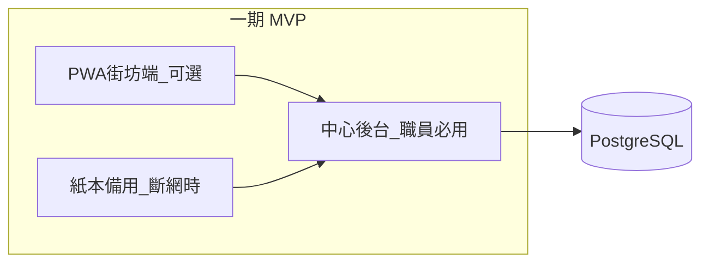

# 產品需求規格（PRD）

**項目名稱**：社區循環經濟與升級改造平台  
**版本**：1.1（規劃階段）  
**目標地區**：香港  
**主要服務對象**：囤積物品的長者（65 歲以上為主，不限）  
**文件語言**：繁體中文（香港書面語）

> **職員易明版**：[PRD-executive.md](PRD-executive.md)（四大功能、月節奏、積分、一期 MVP 邊界；不含 API 及權限矩陣）  
> **閱讀指南**：[design-docs-guide.md](design-docs-guide.md)（P0／P1／P2、用詞解釋、功能對照表）  
> **UX 設計工具包**：[ux-design-kit.md](ux-design-kit.md)（人物誌、同理心地圖、旅程圖、洞察、影響力矩陣）

---

## 1. 產品願景與定位

### 1.1 問題陳述

許多長者家庭因「修好還能用」「總有一天會用到」而保留大量閒置物品。在香港，細小居住空間、屋邨消防安全要求及上落樓梯困難，使囤積更易影響生活質素。長者往往缺乏修繕技能，亦未必熟悉數碼工具，難以使用一般回收或二手平台。

### 1.2 產品定位

以**每月主題交換日**及**修繕／升級改造攤位**為線下樞紐，配合數碼平台作提示、紀錄與配對。**上門關懷與義工代辦**為主要參與渠道，數碼為輔。

**一句話**：讓「仲用得嘅舊物」在街坊之間流轉，透過低壓力交換與修繕，強化社會連結，減少浪費。

### 1.3 成功指標（產品層面）

| 指標        | 目標方向                |
| --------- | ------------------- |
| 長者重複參與率   | 3 個月內 ≥2 次活動參與者占比提升 |
| 人均釋出件數    | 逐月溫和上升（非一次性清空）      |
| 義工代操作占比   | 可反映數碼包容設計是否到位       |
| 修繕完成後交換轉化 | 修繕後選擇釋出之比例          |

---

## 2. 使用者角色與 Persona

### 2.1 主 Persona：囤積物品長者（陳婆婆，72 歲）

- 獨居於公共屋邨，物品多但視為「惜物」
- 不常用 WhatsApp，信任中心職員與義工
- 目標：慢慢整理、修好電風扇、認識街坊，**唔想被人話執屋**

### 2.2 其他角色

| 角色            | 需求摘要              |
| ------------- | ----------------- |
| 社區義工／中心職員     | 快速代登記、現場積分發放、轉介個案 |
| 家人            | 代報名、接收提示（須長者同意）   |
| 修繕師傅／技工       | 接單、更新狀態、上門預約      |
| 活動承辦（地區團體／中心） | 策劃主題日、報表、多據點管理    |
| 街坊（接收方）       | 交換物品、非主敘事         |
| 平台管理員         | 審核師傅、全港據點 KPI     |

---

## 3. 設計原則

1. **漸進式釋出**：單次 1～3 件即可獲積分；無「清完才能參加」門檻
2. **修繕先行、交換在後**：尊重惜物；不跳過修繕直接推動清空
3. **線下為主、數碼為輔**：紙本積分卡與系統帳並行
4. **信任優先**：固定據點、熟識職員、可選不公開姓名
5. **去標籤化溝通**：避免「囤積」「執屋」；見 [glossary-hk.md](glossary-hk.md)

---

## 4. 功能需求

### 4.1 主題交換日

| ID   | 需求                              | 優先級 | 備註         |
| ---- | ------------------------------- | --- | ---------- |
| E-01 | 每月按類別建立活動（衣物、餐具、小型家電、書報、孫輩用品等）  | P0  |            |
| E-02 | 設定地點（屋邨會堂／中心）、日期、攤位類型（交換／修繕／改造） | P0  |            |
| E-03 | 報名（本人或義工代報）                     | P0  | 線下可紙本      |
| E-04 | 現場報到與物品登記（品項、簡述；照片可選）           | P0  |            |
| E-05 | 支援「試水溫」：僅參觀或交換 1 件仍可得歡迎積分       | P0  |            |
| E-06 | 暫存待領：當日未決定釋出，下次活動取回             | P1  | 見 ItemHold |
| E-07 | 交換登記（捐出／換入）由承辦確認                | P0  |            |
| E-08 | 無障礙場地標示（升降機、斜道）                 | P1  | 唐樓試點另評估    |

**交換規則（預設）**

- 「帶多少算多少」：義工協助搬運與登記  
- 積分為感謝誘因，**不以積分強制為物品估價**  
- 以物易物為主；積分為輔助激勵

### 4.2 活動推送

| ID   | 需求                     | 優先級 | 備註              |
| ---- | ---------------------- | --- | --------------- |
| N-01 | 活動前 3 日提醒              | P0  | 一期可人工           |
| N-02 | 報名確認                   | P0  |                 |
| N-03 | 活動異動／取消通知              | P0  |                 |
| N-04 | 修繕單狀態變更通知              | P1  |                 |
| N-05 | 長者偏好：僅電話、暫停通知、WhatsApp | P0  | `elderly_prefs` |
| N-06 | 同一活動不重複轟炸（合併通知）        | P1  |                 |

**渠道優先序（香港）**：上門／電話 > 屋邨告示 > WhatsApp > LINE（可選）> 短訊

**模板結構**：本月主題 + 地點 + 「帶一件即可」

### 4.3 積分錢包

| ID   | 需求                 | 優先級 | 備註             |
| ---- | ------------------ | --- | -------------- |
| W-01 | 每位參與者一個積分帳（含社區編號帳） | P0  |                |
| W-02 | 顯示結餘（大字、圖示）        | P0  |                |
| W-03 | 積分流水（來源、時間、經手人）    | P0  | 可稽核            |
| W-04 | 紙本積分卡與系統同步         | P0  | 斷網時紙本，48 小時內補錄 |
| W-05 | 積分兌換：修繕優先預約、實用品、茶點 | P1  | 不可兌現金          |
| W-06 | 防濫用：單日上限、異常告警      | P1  |                |

**積分規則摘要**（詳見 [data-model.md](data-model.md)）

| 事件         | 建議積分 | 上限         |
| ---------- | ---- | ---------- |
| 首次參加活動     | +10  | 每人一次       |
| 每次活動釋出 1 件 | +5   | 每次活動最多 +15 |
| 歡迎參觀（無釋出）  | +3   | 每人每活動一次    |
| 修繕完成（個案）   | +8   | —          |
| 連續 3 個月參加  | +10  | 每季一次       |

### 4.4 修繕物品工作坊

| ID   | 需求                           | 優先級 | 備註   |
| ---- | ---------------------------- | --- | ---- |
| R-01 | 提交修繕請求（口述由義工代填）              | P0  |      |
| R-02 | 品項類別、簡述、照片可選                 | P0  |      |
| R-03 | 承辦分派師傅                       | P0  |      |
| R-04 | 狀態：待接單、已排期、進行中、完成、無法修、已取消    | P0  |      |
| R-05 | **上門**預約為主；中心定點為輔            | P0  | 雙人義工 |
| R-06 | 高風險品項禁止清單（電力內部、氣體）           | P0  |      |
| R-07 | 完成後引導至交換日（若仍不用）              | P1  |      |
| R-08 | 無法修時提供 GREEN@COMMUNITY 等回收資訊 | P1  |      |

### 4.5 後台（中心／管理員）

| ID   | 需求                   | 優先級 |
| ---- | -------------------- | --- |
| A-01 | 活動 CRUD、現場報到列表       | P0  |
| A-02 | 義工代登記、代發積分           | P0  |
| A-03 | 修繕單分派與狀態更新           | P0  |
| A-04 | 長者參與報表（elderly_flag） | P1  |
| A-05 | 師傅審核與技能標籤            | P1  |
| A-06 | 匯出 CSV（資助報告用）        | P2  |

---

## 5. 使用者故事（摘錄）

### 長者

- **US-E1**：作為長者，我希望只帶一件物品去交換日，義工幫我登記，咁我唔使一次過整理晒。  
- **US-E2**：作為長者，我希望用紙本卡知道我有幾多積分，因為我唔使智能手機。  
- **US-E3**：作為長者，我希望師傅上門修好風扇，再決定留定送俾街坊。

### 義工

- **US-V1**：作為義工，我可以在後台代陳婆婆報名同登記 2 件衣物，並列印積分更新。  
- **US-V2**：作為義工，上門時我只用簡單表格記錄，返中心再入系統。

### 承辦

- **US-O1**：作為中心職員，我可以設定下月「餐具」主題，並一鍵發送 WhatsApp 範本（經審核）。  
- **US-O2**：作為中心職員，我見到疑似嚴重囤積個案，可以標記轉介社署網絡（系統外流程）。

---

## 6. 非功能需求

### 6.1 長者可及性

- 字體 ≥18px（正文）、主要按鈕單屏唯一  
- 對比度
- 主流程 ≤3 步；其餘由義工代完成

### 6.2 個人資料（PDPO）

- 收集最少資料：姓名（可化名）、社區編號、聯絡方式（可選）  
- 代登記須記錄同意方式與時間  
- 支援查閱及更正；保留期限於私隱政策列明

### 6.3 安全

- 上門修繕：雙人義工、預約、家人知情  
- 消防安全：服務為漸進疏導，不替代物管執法  
- 嚴重囤積／自我照顧問題：轉介社署／醫管局社康，**平台不提供診斷**

### 6.4 可用性與營運

- 線下斷網時，紙本登記後 48 小時內補錄  
- 系統可用性目標：一期 MVP 起 99%（辦公時段）

### 6.5 合規

- 積分**非儲值工具**，不可兌換現金，避免觸及儲值支付相關規管  
- 師傅上門服務須符合承辦機構保險及義工守則

---

## 7. 權限矩陣

| 功能      | 長者  | 家人（授權） | 義工  | 師傅  | 承辦  | 管理員 |
| ------- | --- | ------ | --- | --- | --- | --- |
| 查看自己積分  | ✓   | ✓      | 代查  | —   | ✓   | ✓   |
| 報名活動    | ✓   | 代報     | 代報  | —   | ✓   | ✓   |
| 代登記物品   | —   | —      | ✓   | —   | ✓   | ✓   |
| 發放積分    | —   | —      | ✓   | —   | ✓   | ✓   |
| 建立修繕單   | ✓   | 代建     | ✓   | —   | ✓   | ✓   |
| 接單／更新修繕 | —   | —      | —   | ✓   | ✓   | ✓   |
| 活動／報表管理 | —   | —      | —   | —   | ✓   | ✓   |
| 師傅審核    | —   | —      | —   | —   | —   | ✓   |

---

## 8. API 概念（一期 MVP）

REST 或 BFF，JSON；認證採中心職員帳號 + 長者社區編號／一次性驗證碼（細節待資安評估）。

| 資源                           | 方法               | 說明        |
| ---------------------------- | ---------------- | --------- |
| `/communities`               | GET              | 據點列表      |
| `/events`                    | GET, POST        | 活動        |
| `/events/{id}/registrations` | POST             | 報名        |
| `/events/{id}/check-in`      | POST             | 報到        |
| `/item-listings`             | POST             | 物品登記      |
| `/item-holds`                | POST, PATCH      | 暫存待領      |
| `/wallets/{userId}`          | GET              | 積分結餘      |
| `/wallet-transactions`       | POST             | 發放／扣減（職員） |
| `/repair-requests`           | GET, POST, PATCH | 修繕單       |
| `/notifications`             | POST             | 觸發提示（排程）  |
| `/proxy-registrations`       | POST             | 代登記紀錄     |

---

## 9. 分階段交付對照

| 階段  | 產品範圍                                                     |
| --- | -------------------------------------------------------- |
| 一期  | 線下 SOP + **簡易 MVP**（中心後台、PostgreSQL、基本 API）+ 紙本備用 + 人工通知 |
| 二期  | PWA 街坊端完善、半自動通知、基本報表                                     |
| 三期  | WhatsApp／SMS API、資助 KPI 報表、多據點                           |

詳見 [architecture.md](architecture.md)。

### 9.1 一期 MVP 功能邊界

**職員必用 — 中心後台（P0）**

| 功能   | 說明           |
| ---- | ------------ |
| 活動列表 | 建立、編輯每月主題交換日 |
| 報名   | 本人或義工代報      |
| 現場報到 | 報到列表、物品代登記   |
| 積分發放 | 發放／扣減、流水紀錄   |
| 修繕單  | 建立、分派師傅、狀態更新 |

**長者可選用 — PWA 街坊端（P0 最小集）**

| 功能  | 說明           |
| --- | ------------ |
| 查積分 | 大字顯示結餘       |
| 睇活動 | 本月主題、地點、時間   |
| 報名  | 可選；義工代操作仍為預設 |

**紙本並行（不變）**

- 積分卡、斷網時紙本登記、48 小時內補錄

**延至二期（P1）**

- WhatsApp／短訊 API 自動推送
- 多據點 KPI 儀表板
- 師傅端輕量 PWA（可選）

---

## 10. 開放問題

| 項目        | 建議        | 待決     |
| --------- | --------- | ------ |
| 試點屋邨      | —         | 承辦填入   |
| 第一期主題     | 衣物 + 兒童玩具 | 可調整    |
| 積分兌現金     | 不建議       | 建議維持否決 |
| LINE 官方帳號 | 可選渠道      | 視受眾    |

---

## 附錄

- 職員易明版：[PRD-executive.md](PRD-executive.md)  
- 用語：[glossary-hk.md](glossary-hk.md)  
- 旅程：[user-journeys.md](user-journeys.md)  
- 資料：[data-model.md](data-model.md)  
- 本地服務參考：[service-references-hk.md](service-references-hk.md)（DTM、屯門拍檔、哈爾移動椅子、復修辦館、家居維修學院等）

