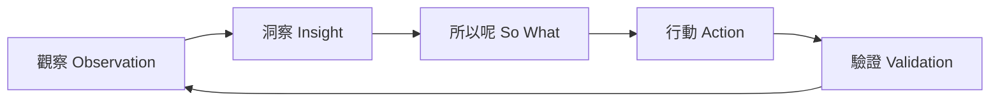

# Actionable Insight Capture（可行洞察捕捉）

**項目**：社區循環經濟與升級改造平台  
**版本**：1.0  
**文件語言**：繁體中文（香港書面語）  
**相關文件**：[user-journey-map.md](user-journey-map.md)、[impact-matrix.md](impact-matrix.md)、[PRD.md](PRD.md)

---

## 1. 什麼係「可行洞察」？

| 層次 | 定義 | 例子 |
|------|------|------|
| **觀察（Observation）** | 可驗證嘅事實 | 「7 成長者唔開 PWA」 |
| **洞察（Insight）** | 觀察背後嘅原因或意義 | 「唔係唔想，係怕按錯、怕畀人笑」 |
| **所以呢（So What）** | 對設計／營運嘅含義 | 「代操作必須係預設主路徑」 |
| **行動（Action）** | 具體、可驗證嘅改動 | 「PWA 只顯示積分；登記由義工代辦」 |

**洞察唔係**：

- ❌ 直接複述用户講嘅話（「陳婆婆話唔識電話」→ 要問：所以呢？）
- ❌ 未經團隊同意嘅個人猜測
- ❌ 太抽象嘅口號（「要關懷長者」→ 要具體到做咩）

---

## 2. 捕捉模板

### 2.1 單條洞察表

| # | 觀察（Observation） | 洞察（Insight） | 所以呢（So What） | 行動（Action） | 負責 | 優先 | 狀態 |
|---|---------------------|-----------------|-------------------|----------------|------|------|------|
| | | | | | | P0/P1 | 待辦／進行中／完成 |

### 2.2 填寫提示

| 欄位 | 問自己 |
|------|--------|
| 觀察 | 我哋見到／聽到咩**事實**？有數據或場景嗎？ |
| 洞察 | **點解**會咁？用戶真正需要係咩？ |
| 所以呢 | 對產品、流程、話術有咩**具體**影響？ |
| 行動 | 誰、做咩、幾時、點樣知成功？ |
| 優先 | P0 = 冇就做唔到服務；P1 = 可二期完善 |

### 2.3 好／差例子

| 類型 | 例子 |
|------|------|
| ❌ 差洞察 | 「長者唔用 App」→ 只係觀察 |
| ✅ 好洞察 | 「長者唔用 App，因為怕按錯被笑 → 代操作為預設，App 只做查積分」 |
| ❌ 差行動 | 「改善 UX」→ 太模糊 |
| ✅ 好行動 | 「代登記流程壓至 3 步；培訓義工 2 月前完成」 |

---

## 3. 本項目已捕捉洞察（I-01 ～ I-10）

| # | 觀察 | 洞察 | 所以呢 | 行動 | 優先 | 狀態 |
|---|------|------|--------|------|------|------|
| **I-01** | 長者聽到「執屋」「囤積」會抗拒 | 去標籤係參與前提 | 對外只用「分享、交換、修好再用」 | 更新 [glossary-hk.md](glossary-hk.md)；海報／話術審稿 | P0 | 規劃中 |
| **I-02** | 首次參加只想「睇下」 | 試水溫係信任入口 | 參觀仍發歡迎積分（E-05） | PRD P0；培訓義工話術 | P0 | 規劃中 |
| **I-03** | 當日未決定放棄物品會焦慮 | 決策壓力阻礙釋出 | 提供暫存待領 | ItemHold P1；一期可紙本暫存 | P1 | 規劃中 |
| **I-04** | 長者唔使 PWA 仍要完整積分 | 數碼包容 = 代辦 + 紙本 | 義工代操作為主路徑 | 旅程 J-C；後台代登記 P0 | P0 | 規劃中 |
| **I-05** | 積分被問「係咪錢」 | 誤解會影響信任同合規 | 每次說明「感謝積分、唔兌現金」 | 積分卡印說明；職員固定話術 | P0 | 規劃中 |
| **I-06** | 師傅擔心入屋被誤解 | 修繕 ≠ 清屋 | 上門必須雙人義工、穿證 | SOP + 入職培訓 | P0 | 規劃中 |
| **I-07** | 家人想代決定釋出物品 | 自主權衝突會傷關係 | 登記以長者口頭意願為準 | 旅程 J-D；職員調停指引 | P0 | 規劃中 |
| **I-08** | 活動後無跟進則缺席下次 | 關懷延續參與 | 3 日後電話 + 下月主題 | N-01 人工；後台提醒列表 | P0 | 規劃中 |
| **I-09** | 修繕完成後先願意考慮釋出 | 修繕先行建立惜物與信任 | 唔跳過修繕推交換 | PRD 設計原則 §3 | P0 | 規劃中 |
| **I-10** | 斷網時義工慌張 | 線下韌性係屋邨必需 | 紙本 + 48h 補錄 | W-04；架構風險緩解 | P0 | 規劃中 |

---

## 4. 洞察來源對照

| 洞察 # | 主要來源 | 相關 Persona | 相關旅程 |
|--------|----------|--------------|----------|
| I-01 | 同理心地圖、服務計劃書 | 陳婆婆、美儀 | J-A |
| I-02 | 旅程圖階段 2–6 | 陳婆婆 | J-A |
| I-03 | 旅程 J-E | 陳婆婆 | J-E |
| I-04 | Persona 數碼欄 | 陳婆婆、阿玲 | J-C |
| I-05 | 積分規則訪談 | 陳婆婆 | J-A |
| I-06 | 師傅同理心地圖 | 強哥 | J-B |
| I-07 | 家人 Persona | 美儀 | J-D |
| I-08 | 情緒曲線階段 8 | 陳婆婆 | J-A |
| I-09 | 服務理念、DSM-5 背景 | 陳婆婆 | J-B |
| I-10 | 旅程失敗恢復 | 阿玲、李姑娘 | 全部 |

---

## 5. 洞察 → 功能對照

| 洞察 | PRD 需求 ID | 功能／營運 |
|------|-------------|------------|
| I-01 | — | 文案、glossary |
| I-02 | E-05 | 歡迎參觀積分 |
| I-03 | E-08（P1） | ItemHold |
| I-04 | W-01, W-04 | 代登記、紙本 |
| I-05 | W-02 | 積分說明 |
| I-06 | R-03 | 上門 SOP |
| I-07 | — | 授權流程 |
| I-08 | N-01 | 關懷電話 |
| I-09 | — | 設計原則 |
| I-10 | W-04 | 離線補錄 |

---

## 6. 洞察驗證清單（試點後填）

試點開始後，用下表驗證洞察是否成立，並決定保留、修正或作廢。

| 洞察 # | 驗證方法 | 成功標準 | 試點結果 | 後續 |
|--------|----------|----------|----------|------|
| I-01 | 邀請話術 A/B（「執屋」vs「分享」） | B 組出席率較高 ≥10% | 待試點 | |
| I-02 | 統計「僅參觀」占比 | ≥20% 首次為參觀 | 待試點 | |
| I-03 | 暫存使用率 | ≥15% 曾用暫存 | 待試點 | |
| I-04 | 代操作占比 | ≥60% 登記經義工 | 待試點 | |
| I-05 | 積分相關投訴 | 0 宗「以為係錢」 | 待試點 | |
| I-08 | 活動後 3 日關懷 | 次月出席率較無關懷組高 | 待試點 | |

---

## 7. 工作坊流程（45 分鐘）

| 步驟 | 時間 | 做法 |
|------|------|------|
| 1. 貼上旅程痛點 | 10 min | 每組從 [user-journey-map.md](user-journey-map.md) 揀 3 個痛點 |
| 2. 寫觀察 | 10 min | 每痛點寫 1 句事實 |
| 3. 提煉洞察 | 15 min | 問 5 次「點解」→ 寫 Insight + So What |
| 4. 定行動 | 10 min | 每組產出 3 條行動，標 P0/P1 |

**產出**：5～10 條新洞察加入 §3 表（編號 I-11 起）

---

## 8. 空白洞察捕捉表（複製用）

| # | 觀察 | 洞察 | 所以呢 | 行動 | 負責 | 優先 | 狀態 |
|---|------|------|--------|------|------|------|------|
| | | | | | | | |
| | | | | | | | |
| | | | | | | | |

---

## 9. 相關文件

| 檔案 | 用途 |
|------|------|
| [impact-matrix.md](impact-matrix.md) | 行動優先排序 |
| [user-journey-map.md](user-journey-map.md) | 痛點來源 |
| [PRD.md](PRD.md) | 需求 ID 對照 |
