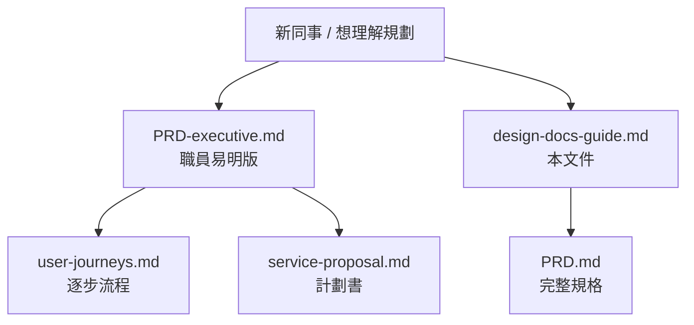

# 設計文件閱讀指南

**項目**：社區循環經濟與升級改造平台  
**版本**：1.0  
**主要讀者**：中心職員、義工隊長、項目主任、新加入同事  
**文件語言**：繁體中文（香港書面語）

本文件解釋規劃文件庫入面常見用詞（例如 **P0／P1／P2**、**MVP**、**Persona**），以及各份文件應該點樣閱讀。  
若你只想快速了解服務內容，請先閱 [PRD-executive.md](PRD-executive.md)。

---

## 1. 我應該睇邊份文件？

| 你想知咩 | 建議閱讀 |
|----------|----------|
| 服務做咩、每月點跑 | [PRD-executive.md](PRD-executive.md) |
| P0／P1 係咩、文件點睇 | **本文件** |
| 陳婆婆第一次嚟交換日逐步做咩 | [user-journeys.md](user-journeys.md) |
| 人物誌、同理心、旅程圖、洞察、優先排序 | [ux-design-kit.md](ux-design-kit.md) → [user-personas.md](user-personas.md) 等 |
| 畫面結構、導覽流程、Sitemap | [wireflow.md](wireflow.md) |
| 高保真線框、Figma 規格、Design Tokens | [wireflow-hifi.md](wireflow-hifi.md) · [預覽](wireframes/preview.html) |
| 積分點計、修繕單有咩狀態 | [data-model.md](data-model.md) §4 |
| 申請資助、KPI、預算 | [service-proposal.md](service-proposal.md) |
| 全部功能清單、權限、API | [PRD.md](PRD.md) |
| 一期做咩系統、幾時做自動推送 | [architecture.md](architecture.md) §3 |
| 海報用字、粵語句例 | [glossary-hk.md](glossary-hk.md) |
| 屯門拍檔、復修辦館等參考 | [service-references-hk.md](service-references-hk.md) |

---

## 2. 優先級 P0／P1／P2 係咩？

### 2.1 一句話

**優先級**表示「呢項功能有幾重要」，唔係政府優先級，亦唔係緊急程度。

| 標記 | 白話意思 | 冇做會點？ |
|------|----------|------------|
| **P0** | **一定要有** | 服務開唔到，或核心流程做唔完整 |
| **P1** | **好重要，但可以第二階段先完善** | 仲可以營運，只係體驗或效率差啲 |
| **P2** | **有就更好** | 多數係報表、管理、資助申報用 |

### 2.2 重要：P0 唔等於「一定要用 App」

P0 只表示**結果一定要有**；**做法**可以係人工或紙本。

| 例子（來自 [PRD.md](PRD.md)） | 優先級 | 備註 | 實際做法 |
|-------------------------------|--------|------|----------|
| 活動前 3 日提醒 | P0 | 一期可人工 | 職員**打電話**都得 |
| 紙本積分卡同系統同步 | P0 | 斷網時紙本 | 先寫卡，48 小時內補錄 |
| 暫存待領 | P1 | — | 初期可用紙本記低 |
| 匯出 CSV 資助報告 | P2 | — | 初期 Excel 頂住 |

**記法**：

- **P0 + 人工** = 一定要做到，電話／紙本可以先頂住  
- **P1** = 重要，但第二輪先做好  
- **P2** = 報表類，後做  

---

## 3. P0／P1 同「一期／二期／三期」有咩唔同？

呢兩套概念**唔係同一樣嘢**，容易混淆：

| 概念 | 問嘅問題 | 例子 |
|------|----------|------|
| **P0 / P1 / P2** | 呢個**功能**重唔重要？ | 「暫存待領」係 P1 |
| **一期 / 二期 / 三期** | **幾時**做、用咩**方式**做？ | 一期做簡易 MVP；三期先做 WhatsApp 自動推送 |

| 階段 | 時間（示例） | 重點 |
|------|--------------|------|
| **一期** | 0～6 月 | 線下 SOP + 簡易 MVP（中心後台 + 可選 PWA）+ 紙本備用 + **人工**通知 |
| **二期** | 6～12 月 | PWA 完善、半自動通知、基本報表 |
| **三期** | 12 月+ | WhatsApp／短訊 API、多據點 KPI 儀表板 |

詳見 [PRD.md](PRD.md) §9、[architecture.md](architecture.md) §3。

---

## 4. 功能需求表常見用詞

### 4.1 需求 ID（E-01、N-02…）

只係**編號**，方便開會、寫報告時引用，唔使死記。

| 前綴 | 代表 |
|------|------|
| **E-** | Event，主題交換日 |
| **N-** | Notification，活動推送 |
| **W-** | Wallet，積分錢包 |
| **R-** | Repair，修繕工作坊 |
| **A-** | Admin，後台管理 |

### 4.2 其他英文／技術詞

| 用詞 | 意思（職員版） |
|------|----------------|
| **MVP** | 最細可行版本 — 夠開服務、紀錄、派單，但唔係所有花巧功能都有 |
| **Persona** | 假想代表用户（如陳婆婆），幫大家諗「長者會點用」 |
| **CRUD** | 建立、查看、修改、刪除 — 後台可以管理活動 |
| **PWA** | 用手機瀏覽器開嘅網頁 App，唔使去 App Store 下載 |
| **API** | 系統之間傳資料嘅接口 — 職員日常唔使理 |
| **PostgreSQL** | 資料庫 — 儲存活動、積分、修繕單 |
| **elderly_prefs** | 長者通知偏好（只打電話、暫停通知等） |
| **ItemHold** | 「暫存待領」嘅系統紀錄 |
| **elderly_flag** | 標記係主服務對象（長者）嘅參與紀錄，用於報表 |

### 4.3 「備註」欄點讀

| 備註 | 意思 |
|------|------|
| 線下可紙本 | 唔使等 App，紙本登記都得 |
| 一期可人工 | 初期職員手動做（例如打電話提醒） |
| 見 data-model.md | 詳細規則喺資料模型文件 |
| 不可兌現金 | 積分唔係錢，唔可以換現金 |

---

## 5. 功能需求 → 職員實際要做咩（對照表）

以下對照 [PRD.md](PRD.md) §4，將每項需求譯成前線語言。

### 5.1 主題交換日

| ID | 需求 | 優先級 | 職員實際要做咩 |
|----|------|--------|----------------|
| E-01 | 每月按類別建立活動 | P0 | 喺後台（或初期紙本）設定本月主題，例如「衣物」 |
| E-02 | 設定地點、日期、攤位類型 | P0 | 填會堂地址、交換／修繕／改造攤 |
| E-03 | 報名 | P0 | 幫長者代報，或現場即報 |
| E-04 | 現場報到同物品登記 | P0 | 簽到、口頭問品項、幫手登記 1～3 件 |
| E-05 | 試水溫（只參觀都有積分） | P0 | 長者只嚟睇都照發歡迎積分，唔追住換嘢 |
| E-06 | 暫存待領 | P1 | 今日未決定：記低物品，下次活動再拎 |
| E-07 | 交換登記由承辦確認 | P0 | 職員確認捐出／換入，先計積分 |
| E-08 | 無障礙場地標示 | P1 | 海報註明有冇升降機、斜道 |

### 5.2 活動推送

| ID | 需求 | 優先級 | 職員實際要做咩 |
|----|------|--------|----------------|
| N-01 | 活動前 3 日提醒 | P0 | **打電話**或上門提醒（初期人工） |
| N-02 | 報名確認 | P0 | 口頭或 WhatsApp 確認「已幫你報名」 |
| N-03 | 異動／取消通知 | P0 | 改期或取消要主動通知已報名長者 |
| N-04 | 修繕單狀態通知 | P1 | 師傅接單、完成時通知長者（可先電話） |
| N-05 | 長者通知偏好 | P0 | 問清楚：只打電話？暫停通知？ |
| N-06 | 合併通知、唔重複轟炸 | P1 | 同一活動唔好一日內連打幾次 |

### 5.3 積分錢包

| ID | 需求 | 優先級 | 職員實際要做咩 |
|----|------|--------|----------------|
| W-01 | 每人一個積分賬 | P0 | 用社區編號或紙本卡對應一位長者 |
| W-02 | 顯示結餘 | P0 | 口頭讀出；紙本卡或 PWA 大字顯示 |
| W-03 | 積分流水 | P0 | 每次發分記錄來源、時間、邊個經手 |
| W-04 | 紙本卡同系統同步 | P0 | 斷網寫卡，恢復後 48 小時內補錄 |
| W-05 | 積分兌換 | P1 | 換修繕優先、禮物、茶點（**唔可以換現金**） |
| W-06 | 防濫用上限 | P1 | 後台設定單日上限；異常要報告 |

### 5.4 修繕工作坊

| ID | 需求 | 優先級 | 職員實際要做咩 |
|----|------|--------|----------------|
| R-01 | 提交修繕請求 | P0 | 聽長者口述，義工代填單 |
| R-02 | 品項、簡述、照片 | P0 | 填類別同簡單描述；照片可選 |
| R-03 | 分派師傅 | P0 | 中心職員派合適師傅 |
| R-04 | 修繕狀態更新 | P0 | 待接單 → 已排期 → 進行中 → 完成／無法修 |
| R-05 | 以上門修繕為主 | P0 | 預約上門；**必須雙人義工** |
| R-06 | 高風險禁制清單 | P0 | 電力內部、氣體等唔接；轉介專業 |
| R-07 | 完成後引導交換 | P1 | 修好仍唔要，邀請下次交換日釋出 |
| R-08 | 無法修時回收資訊 | P1 | 提供 GREEN@COMMUNITY 等合法渠道 |

### 5.5 後台

| ID | 需求 | 優先級 | 職員實際要做咩 |
|----|------|--------|----------------|
| A-01 | 活動管理、報到列表 | P0 | 後台建立活動、現場睇邊個已到 |
| A-02 | 代登記、代發積分 | P0 | 幫唔識用電話嘅長者操作 |
| A-03 | 修繕單分派 | P0 | 派師傅、更新狀態 |
| A-04 | 長者參與報表 | P1 | 睇邊個長者參加過幾多次 |
| A-05 | 師傅審核、技能標籤 | P1 | 確認師傅資格同擅長項目 |
| A-06 | 匯出 CSV | P2 | 資助報告用；初期 Excel 頂住 |

---

## 6. 例子：陳婆婆第一次參加交換日

| 步驟 | 對應功能 | 優先級 | 一期點做 |
|------|----------|--------|----------|
| 職員打電話邀請 | N-01 | P0 | **人工**打電話 |
| 義工代報名 | E-03 | P0 | 後台或紙本 |
| 到場登記 1 件衫 | E-04 | P0 | 後台必做 |
| 只參觀唔換嘢 | E-05 | P0 | 照發歡迎積分 +3 |
| 今日未決定拎唔拎走 | E-06 | P1 | 紙本暫存，下次再拎 |
| 更新積分 | W-01～W-04 | P0 | 後台 + 紙本卡 |

完整流程見 [user-journeys.md](user-journeys.md) §2。

---

## 7. 各份文件係咩角色？（文件地圖）

| 文件 | 好似咩 | 適合邊個 |
|------|--------|----------|
| [PRD-executive.md](PRD-executive.md) | **一頁紙簡介** | 職員、義工 |
| [design-docs-guide.md](design-docs-guide.md) | **說明書／字典** | 新同事、唔識 P0 嘅人 |
| [PRD.md](PRD.md) | **完整規格書** | 項目主任、開發 |
| [service-proposal.md](service-proposal.md) | **計劃書** | 資助、合作機構 |
| [user-journeys.md](user-journeys.md) | **劇本／流程圖** | 培訓、前線 |
| [data-model.md](data-model.md) | **登記簿格式** | 開發、資料同事 |
| [architecture.md](architecture.md) | **工程圖** | IT、開發 |
| [glossary-hk.md](glossary-hk.md) | **用字表** | 宣傳、前線 |
| [service-references-hk.md](service-references-hk.md) | **同行參考** | 寫計劃書、洽談伙伴 |

---

## 8. 快速記憶卡

| 問題 | 答案 |
|------|------|
| P0 係咩？ | 冇就開唔到服務（可以用電話／紙本頂住） |
| P1 係咩？ | 重要，第二輪先做好 |
| P2 係咩？ | 報表、管理類，後做 |
| 一期做咩？ | 後台 + 可選 PWA + 紙本；通知以人工為主 |
| 積分係咪錢？ | **唔係**；社區感謝積分，不可兌現金 |
| 長者一定要用手機？ | **唔使**；義工代操作係預設 |
| 睇唔明 PRD 表格？ | 查 [design-docs-guide.md](design-docs-guide.md) §5 |
| 做工作坊／人物誌？ | 查 [ux-design-kit.md](ux-design-kit.md) |

---

## 附錄：相關文件

- [PRD-executive.md](PRD-executive.md) — 職員易明版  
- [PRD.md](PRD.md) — 完整產品規格  
- [glossary-hk.md](glossary-hk.md) — 香港用語同粵語宣傳句例
