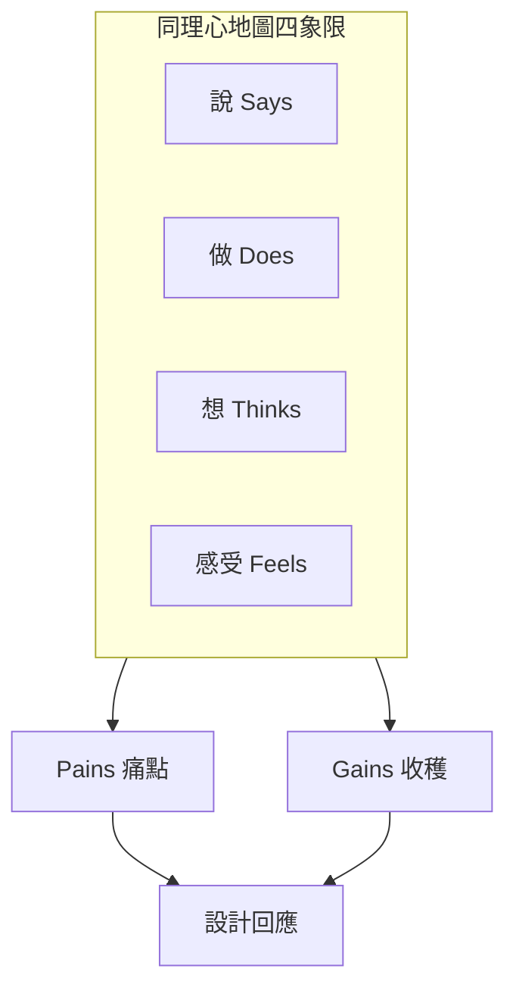

# 同理心地圖（Empathy Maps）

**項目**：社區循環經濟與升級改造平台  
**版本**：1.0  
**文件語言**：繁體中文（香港書面語）  
**相關文件**：[user-personas.md](user-personas.md)、[user-journey-map.md](user-journey-map.md)

---

## 1. 什麼是同理心地圖？

**同理心地圖（Empathy Map）** 幫團隊代入用户，整理佢哋：

- **說（Says）** — 會講出口嘅話
- **做（Does）** — 實際行為
- **想（Thinks）** — 心入面諗緊咩（未必講出嚟）
- **感受（Feels）** — 情緒狀態
- **聽／睇（Hears / Sees）** — 外界環境同訊息

再加 **痛點（Pains）** 同 **收穫（Gains）**，連結到設計決策。

**使用時機**：人物誌確認後、畫旅程圖之前；工作坊每組揀一個 Persona 填一張。

---

## 2. 陳婆婆 — 同理心地圖（主 Persona）

### 2.1 四象限

| | **外在（可觀察）** | **內在** |
|---|-------------------|----------|
| **說／做** | **說**：「呢件衫仲新…」「帶一件嚟都得？我試下。」「我唔識㩒電話，阿玲幫我就得。」  **做**：留壞電器、收孫輩舊物；接中心電話；由義工帶一件去會堂；到場先行近靜區 | **想**：驚被睇低、驚子女話唔照顧；想有人陪；想證明自己仲有用、唔係浪費  **感受**：受邀時抗拒 → 同義工傾完稍安 → 到場緊張 → 參與後有面子、開心 |
| **聽／睇** | **聽**：電視斷捨離、物管消防提醒、街坊話「唔使執屋，分享就得」  **睇**：海報「帶一件即可」、熟識職員、街坊換到合用物、紙本積分卡大字 | （同上內在欄） |

### 2.2 痛點（Pains）

| 痛點 | 嚴重度 | 設計回應 |
|------|--------|----------|
| 缺乏修繕技能，物品閒置 | 高 | 修繕工作坊、上門師傅 |
| 數碼障礙、怕按錯 | 高 | 義工代操作、紙本卡 |
| 怕標籤「囤積」「執屋」 | 高 | 去標籤文案 [glossary-hk.md](glossary-hk.md) |
| 當場被迫決定放棄物品 | 中 | 暫存待領（ItemHold） |
| 怕物品被估價睇低 | 中 | 以物易物、感謝積分，唔估價 |

### 2.3 收穫（Gains）

| 收穫 | 設計如何支援 |
|------|--------------|
| 低壓力釋出仍被感謝 | 1～3 件即可；歡迎參觀仍有積分 |
| 上門修好風扇，延長物品壽命 | 修繕先行、雙人義工上門 |
| 認識街坊、固定聚會 | 每月主題交換日 |
| 有積分、有紙卡，感覺「做咗好事」 | 口頭讀出結餘、大字卡 |

### 2.4 心理學背景（囤積理解）

| 框架 | 對陳婆婆嘅含義 |
|------|----------------|
| **DSM-5 囤積症** | 囤積可能填補情感空虛；唔可以用「清理」作唯一介入 |
| **物件依戀（Frost & Steketee）** | 物品 = 回憶、身份、安全感；要保留價值感 |
| **從囤積到交流** | 將「剝奪感」轉為「分享、造福他人」嘅成就感 |

---

## 3. 阿玲（義工）— 同理心地圖

| 象限 | 內容 |
|------|------|
| **說** | 「陳婆婆，我幫你登記，你話我聽就得。」「今日人多，我哋去靜啲嘅位。」「你帶一件嚟已經好叻。」 |
| **做** | 代填表、帶長者報到、讀積分、上門收件、引導退縮長者 |
| **想** | 要快又唔使人難堪；唔好記錯積分；希望長者下次願意再嚟 |
| **感受** | 見到長者笑會開心；系統 lag 或斷網時焦慮；被長者拒絕代登記時無奈 |
| **聽／睇** | 聽職員講本月主題；睇後台報到列表、禁制清單、現場人流 |
| **痛點** | 斷網；長者臨時退縮；唔知修繕禁制；一次過登記太多步驟 |
| **收穫** | 後台 3 步代登記；紙本後備；清晰 SOP；靜區同一對一腳本 |

---

## 4. 李姑娘（中心職員）— 同理心地圖

| 象限 | 內容 |
|------|------|
| **說** | 「本月主題係童玩，我哋逐個電話邀請。」「師傅，下星期三上門，地址係…」「報告前要出參與人次。」 |
| **做** | 建活動、派單、發積分、轉介、寫報告、活動後關懷電話 |
| **想** | KPI、安全、個案唔好出錯；希望一個後台睇晒 |
| **感受** | 活動順利有成就感；嚴重個案擔心；趕報告時壓力大 |
| **聽／睇** | 聽資助方要求、師傅檔期；睇報到名單、未出席長者、修繕積壓 |
| **痛點** | 師傅檔期；報表趕工；多系統來回；斷網時現場亂 |
| **收穫** | 一個後台：報到、修繕、積分、提醒列表 |

---

## 5. 強哥（修繕師傅）— 同理心地圖

| 象限 | 內容 |
|------|------|
| **說** | 「我睇下先…呢個可以修。」「電力入面我唔做，要搵持牌师傅。」「修唔到我都會寫清楚原因。」 |
| **做** | 接單、上門檢查、維修、更新狀態、教長者簡單保養 |
| **想** | 準時、唔被誤解、唔被催做高危工程 |
| **感受** | 修好有成就感；屋企無位時無奈；被當「執屋」時不快 |
| **痛點** | 地址難找；物品多無位；單據唔清晰；完成後被催交換 |
| **收穫** | 修繕單狀態清晰；雙人義工陪同；禁制清單；長者自主決定留用或釋出 |

---

## 6. 美儀（家人）— 同理心地圖

| 象限 | 內容 |
|------|------|
| **說** | 「我想幫媽媽，但佢唔聽我。」「可唔可以 WhatsApp 通知我下次活動？」「我唔想佢覺得我嫌佢。」 |
| **做** | 代查詢、陪同首次、協助電話預約（經媽媽同意） |
| **想** | 媽媽安全；唔傷自尊；唔想同媽媽拗撬 |
| **感受** | 擔心、內疚、有時無力 |
| **痛點** | 被媽媽拒絕「幫執屋」；唔知正式渠道；怕標籤化 |
| **收穫** | 中心做橋樑；代報名有授權記錄；職員調停指引 |

---

## 7. 跨 Persona 痛點對照

| 痛點主題 | 陳婆婆 | 阿玲 | 李姑娘 | 強哥 | 美儀 |
|----------|--------|------|--------|------|------|
| 去標籤溝通 | ●●● | ●● | ●● | ● | ●●● |
| 代操作／紙本 | ●●● | ●●● | ●● | — | ● |
| 修繕安全 | ●● | ●● | ●●● | ●●● | ●● |
| 當場決策壓力 | ●●● | ●● | ● | — | ●● |
| 系統斷網韌性 | ●● | ●●● | ●●● | ● | — |

*● 越多 = 越受影響*

---

## 8. 空白同理心地圖模板（工作坊用）

**Persona 名稱**：________________  
**日期／填寫人**：________________

| | **說 Says** | **做 Does** |
|---|-------------|-------------|
| **想 Thinks** | | |
| **感受 Feels** | | |

**聽 Hears**：  
**睇 Sees**：

| **痛點 Pains** | **收穫 Gains** |
|----------------|----------------|
| | |

**設計回應（3 項）**：

1.  
2.  
3.  

---

## 9. 相關文件

| 檔案 | 用途 |
|------|------|
| [user-personas.md](user-personas.md) | 完整人物誌 |
| [user-journey-map.md](user-journey-map.md) | 旅程階段與情緒 |
| [actionable-insights.md](actionable-insights.md) | 從痛點提煉可行洞察 |
