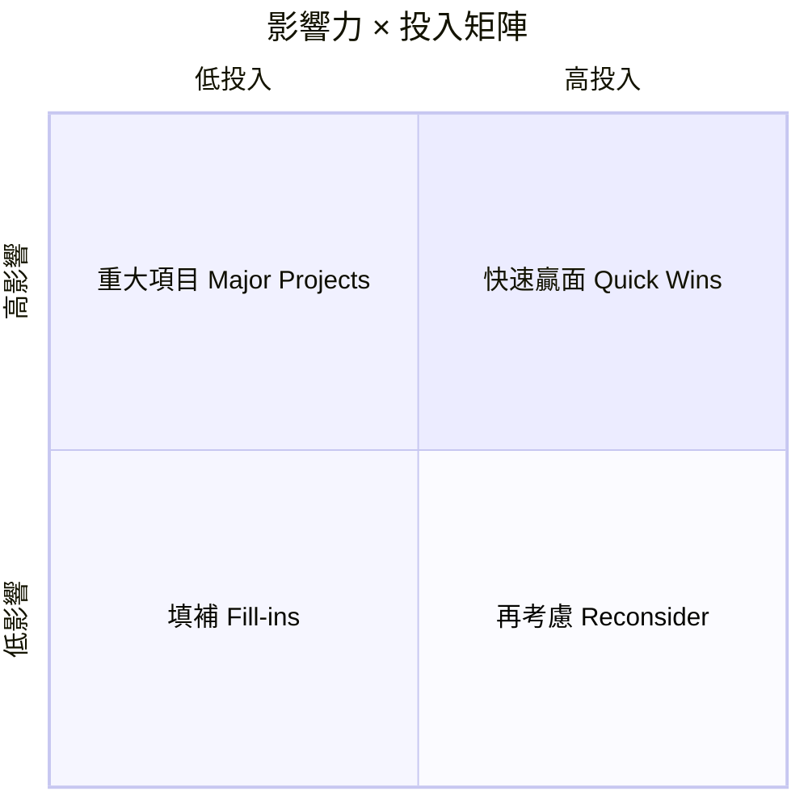

# Impact Matrix（影響力 × 投入矩陣）

**項目**：社區循環經濟與升級改造平台  
**版本**：1.0  
**文件語言**：繁體中文（香港書面語）  
**相關文件**：[actionable-insights.md](actionable-insights.md)、[PRD.md](PRD.md)、[architecture.md](architecture.md)

---

## 1. 矩陣用途

**Impact Matrix（影響力 × 投入矩陣）** 用嚟回答：

> 有限資源下，邊個想法／功能／營運改動值得**先做**？

本項目採 **影響力（Impact）× 投入（Effort）** 四象限（常見於產品優先排序）。  
若工作坊需要「創新度 × 影響力」變體，可另加一軸；落地執行以本矩陣為準。

| 象限 | 影響力 | 投入 | 策略 |
|------|--------|------|------|
| **Q1 快速贏面** | 高 | 低 | **一期必做** — 最快見效 |
| **Q2 重大項目** | 高 | 高 | 分階段；一期做 MVP 核心 |
| **Q3 填補** | 低 | 低 | 有空再做 |
| **Q4 再考慮** | 低 | 高 | 暫緩或不做 |

---

## 2. 評分標準

### 2.1 影響力（Impact）

對 **陳婆婆（主 Persona）** 同 **服務目標**（參與、釋出、修繕、連結）嘅影響。

| 等級 | 定義 | 例子 |
|------|------|------|
| **高 H** | 冇就做唔到核心服務，或嚴重影響信任 | 代登記、去標籤話術 |
| **中 M** | 明顯改善體驗或效率，但可替代 | PWA 查積分 |
| **低 L** | 錦上添花、少數用户 | 多據點儀表板 |

### 2.2 投入（Effort）

時間、金錢、技術難度、培訓成本、合規成本嘅綜合。

| 等級 | 定義 | 例子 |
|------|------|------|
| **低 L** | ≤2 週、主要係流程／文案 | 話術 SOP、紙本卡 |
| **中 M** | 1～2 個月、需開發或協調 | 中心後台 MVP |
| **高 H** | ≥3 個月、多系統整合 | WhatsApp API、原生 App |

---

## 3. 本項目功能／想法矩陣

| 想法 | 影響力 | 投入 | 象限 | 建議階段 | 對應洞察 |
|------|--------|------|------|----------|----------|
| 電話／上門邀請 +「帶一件即可」話術 | 高 | 低 | Q1 快速贏面 | 一期 | I-01, I-08 |
| 義工代登記 + 紙本積分卡 | 高 | 低 | Q1 快速贏面 | 一期 | I-04, I-10 |
| 試水溫參觀仍發積分 | 高 | 低 | Q1 快速贏面 | 一期 | I-02 |
| 修繕禁制清單培訓 | 高 | 低 | Q1 快速贏面 | 一期 | I-06 |
| 活動後 3 日電話關懷 | 高 | 低 | Q1 快速贏面 | 一期 | I-08 |
| 積分「唔兌現金」話術同卡面說明 | 高 | 低 | Q1 快速贏面 | 一期 | I-05 |
| 上門修繕雙人義工 SOP | 高 | 低 | Q1 快速贏面 | 一期 | I-06 |
| 中心後台（活動、報到、積分、修繕單） | 高 | 中 | Q2 重大項目 | 一期 MVP | I-04, I-10 |
| 上門修繕配對流程 | 高 | 中 | Q2 重大項目 | 一期 | I-09 |
| 簡易 PWA（大字查積分／活動） | 中 | 中 | Q2 重大項目 | 一期可選 | I-04 |
| 暫存待領（系統 ItemHold） | 高 | 中 | Q2 重大項目 | 一期紙本 / P1 系統 | I-03 |
| 積分兌換禮物／修繕優先 | 中 | 中 | Q3 填補 | 二期 | — |
| 師傅端 PWA 接單 | 中 | 中 | Q3 填補 | 三期可選 | — |
| 多據點 KPI 儀表板 | 中 | 高 | Q4 再考慮 | 三期 | — |
| WhatsApp 自動推送 API | 中 | 高 | Q4 再考慮 | 三期 | — |
| 原生 App（長者端） | 低 | 高 | Q4 再考慮 | 唔建議 | — |
| NFT／區塊鏈積分 | 低 | 高 | Q4 再考慮 | 唔做 | — |

---

## 4. 視覺化：一期清單

### 4.1 Q1 快速贏面 — 一期必做

- 去標籤話術與海報（[glossary-hk.md](glossary-hk.md)）
- 代登記 SOP（≤3 步）
- 紙本積分卡 + 口頭讀出結餘
- 歡迎參觀積分（E-05）
- 修繕禁制清單（一頁紙）
- 上門雙人義工、穿證
- 活動後 3 日電話關懷
- 積分合規說明（唔兌現金）

### 4.2 Q2 重大項目 — 一期核心

- 中心後台 + PostgreSQL（活動、報到、積分、修繕單）
- 上門修繕配對與狀態流轉
- 簡易 PWA（可選，長者查積分）
- 暫存待領（一期紙本 → P1 系統化）

### 4.3 二期／三期

- 積分兌換、進階報表
- 暫存待領全系統化
- WhatsApp／SMS API
- 師傅端接單

### 4.4 暫緩／不做

- 長者原生 App（投入高、影響低 — 代操作已覆蓋）
- 與商業點數平台合併
- 區塊鏈積分

---

## 5. 矩陣 × PRD 優先級對照

| 象限 | 典型 P0 | 典型 P1 |
|------|---------|---------|
| Q1 快速贏面 | 話術、代登記、紙本、關懷電話 | — |
| Q2 重大項目 | 後台 MVP、修繕流程 | ItemHold 系統、PWA |
| Q3 填補 | — | 積分兌換、報表 |
| Q4 再考慮 | — | API 推送、多據點儀表板 |

詳細需求 ID 見 [PRD.md](PRD.md) §4。

---

## 6. ICE 評分（進階工作坊，可選）

若團隊要更細排序，可為每個想法打 **1～10 分**：

**ICE 分 = (Impact + Confidence + Ease) / 3**

| 想法 | Impact | Confidence | Ease | ICE 分 | 象限 |
|------|--------|------------|------|--------|------|
| 代登記 SOP | 9 | 9 | 9 | **9.0** | Q1 |
| 去標籤話術 | 9 | 8 | 9 | **8.7** | Q1 |
| 中心後台 MVP | 9 | 8 | 6 | **7.7** | Q2 |
| 暫存待領系統 | 8 | 7 | 6 | **7.0** | Q2 |
| 簡易 PWA | 6 | 7 | 6 | **6.3** | Q2 |
| WhatsApp API | 6 | 7 | 4 | **5.7** | Q4 |
| 長者原生 App | 3 | 4 | 2 | **3.0** | Q4 |
| （自填） | | | | | |

**Confidence** = 團隊對「做咗會有效」嘅信心  
**Ease** = 實施容易度（越高越容易）

---

## 7. 工作坊：30 分鐘排序流程

| 步驟 | 做法 |
|------|------|
| 1 | 從 [actionable-insights.md](actionable-insights.md) 拎 5～10 條行動 |
| 2 | 每條標 H/M/L 影響力 + H/M/L 投入 |
| 3 | 貼上四象限白板 |
| 4 | Q1 全部納入一期；Q2 揀 MVP 範圍；Q4 標「不做」 |
| 5 | 產出「一期必做清單」交項目主任 |

---

## 8. 空白 Impact Matrix 模板

| 想法 | 影響力 H/M/L | 投入 H/M/L | 象限 Q1–Q4 | 階段 | 備註 |
|------|--------------|------------|------------|------|------|
| | | | | | |
| | | | | | |
| | | | | | |

---

## 9. 相關文件

| 檔案 | 用途 |
|------|------|
| [actionable-insights.md](actionable-insights.md) | 洞察 → 行動 |
| [architecture.md](architecture.md) | 一期 MVP 技術邊界 |
| [design-docs-guide.md](design-docs-guide.md) | P0/P1 解釋 |
| [ux-design-kit.md](ux-design-kit.md) | 半日工作坊總流程 |
