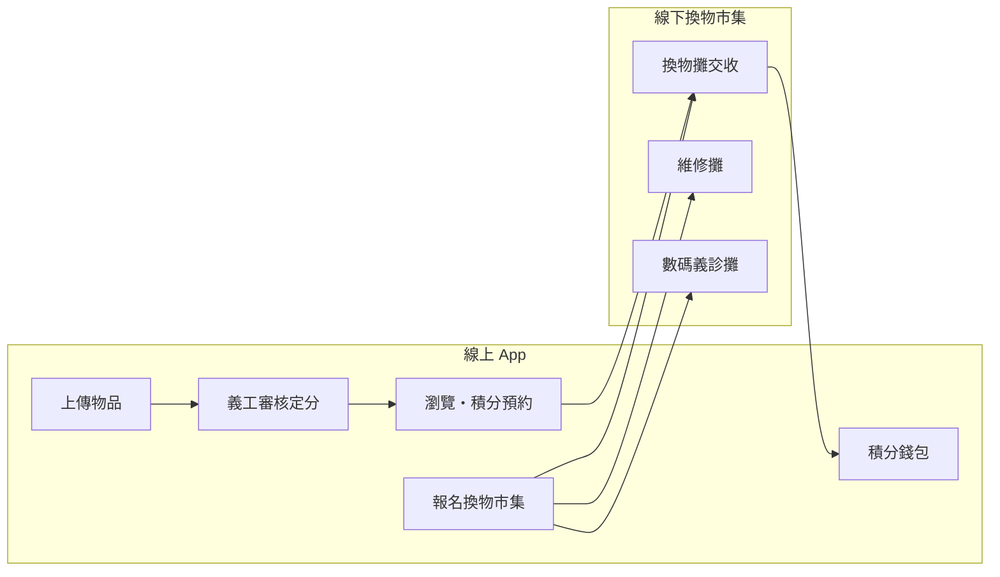
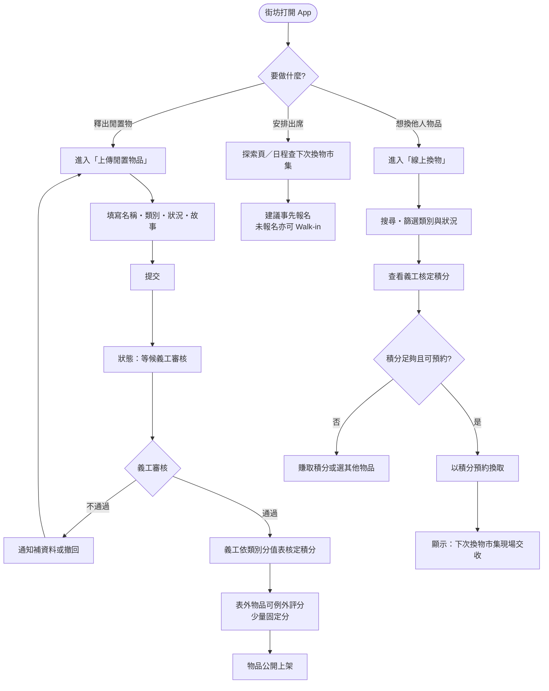
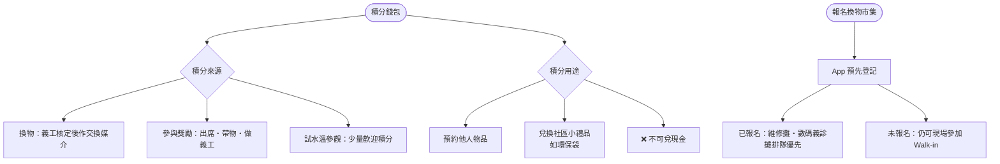
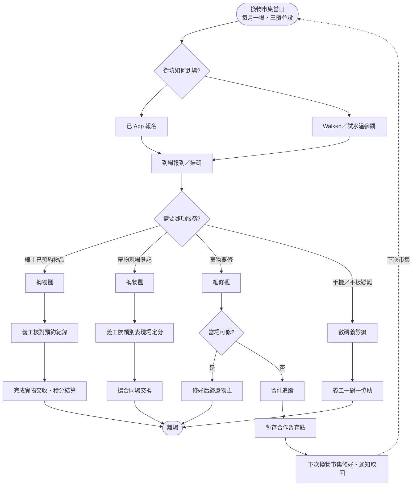
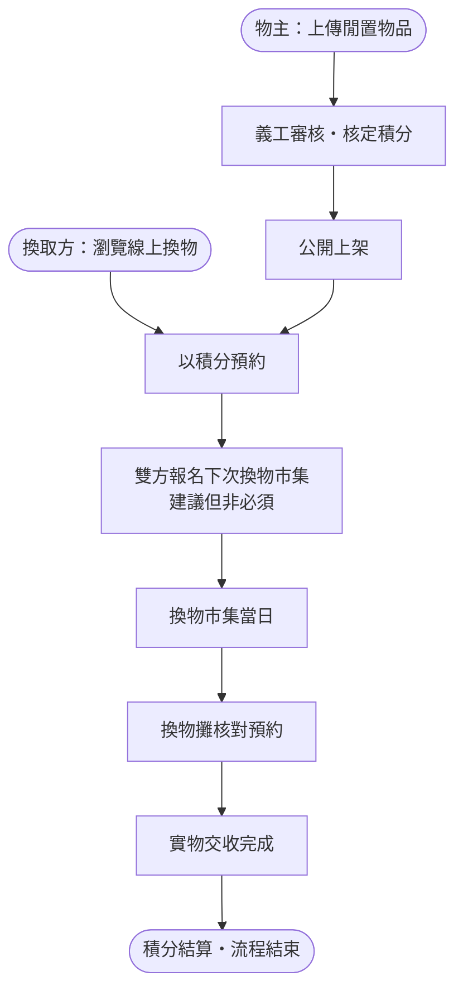

# 線上線下活動逐步流程圖

**項目**：社區換物 Carousell（Community-Sweep）  
**版本**：1.0  
**文件語言**：繁體中文（臺灣書面語）  
**對應領域文件**：[`CONTEXT.md`](../CONTEXT.md)、[`docs/adr/0001-online-item-trading.md`](adr/0001-online-item-trading.md)

> 本文件描述街坊參與換物相關活動的完整路徑，分為**線上**（App）與**線下**（每月換物市集）兩部分，並說明兩者如何銜接。

---

## 一、總覽：線上媒合、線下交收



**原則**

- 線上：瀏覽、上架、預約、報名、積分紀錄
- 線下：實物交收、即場修繕、數碼協助
- 積分由義工依類別分值表核定；不可兌現金、不以港元標價

---

## 二、線上流程：上架 → 審核 → 公開



---

## 三、線上流程：積分與報名



---

## 四、線下流程：換物市集當日



---

## 五、端到端：從上架到交收（完整路徑）



---

## 六、角色對照

| 步驟 | 線上／線下 | 主要角色 |
|------|------------|----------|
| 上傳物品 | 線上 | 街坊（物主） |
| 審核・定分 | 線上 | 義工 |
| 瀏覽・預約 | 線上 | 街坊（換取方） |
| 報名市集 | 線上 | 街坊 |
| 實物交收 | 線下・換物攤 | 義工＋雙方街坊 |
| 即場修繕 | 線下・維修攤 | 師傅／義工 |
| 留件追蹤 | 線下→線下 | 義工＋暫存點 |
| 數碼協助 | 線下・數碼義診攤 | 義工 |
| 積分紀錄 | 線上 | App（示範版 mock） |

---

## 七、已匯出圖片（可直接下載）

圖片已產生於 [`docs/assets/flowcharts/`](assets/flowcharts/)：

| # | 說明 | PNG | SVG |
|---|------|-----|-----|
| 1 | 總覽：線上媒合、線下交收 | [01-overview.png](assets/flowcharts/01-overview.png) | [01-overview.svg](assets/flowcharts/01-overview.svg) |
| 2 | 線上：上架 → 審核 → 公開 | [02-online-upload.png](assets/flowcharts/02-online-upload.png) | [02-online-upload.svg](assets/flowcharts/02-online-upload.svg) |
| 3 | 線上：積分與報名 | [03-online-points.png](assets/flowcharts/03-online-points.png) | [03-online-points.svg](assets/flowcharts/03-online-points.svg) |
| 4 | 線下：換物市集當日 | [04-offline-market.png](assets/flowcharts/04-offline-market.png) | [04-offline-market.svg](assets/flowcharts/04-offline-market.svg) |
| 5 | 端到端：上架到交收 | [05-end-to-end.png](assets/flowcharts/05-end-to-end.png) | [05-end-to-end.svg](assets/flowcharts/05-end-to-end.svg) |

在 Cursor 左側檔案總管展開 `docs/assets/flowcharts/`，對 `.png` 或 `.svg` 右鍵即可另存／複製。

若要重新產生圖片，可執行專案根目錄：

```powershell
$dir = "docs/assets/flowcharts"
$cfg = "$dir/mermaid-config.json"
@("01-overview","02-online-upload","03-online-points","04-offline-market","05-end-to-end") | ForEach-Object {
  npx -y @mermaid-js/mermaid-cli@11 -c $cfg -i "$dir/$_.mmd" -o "$dir/$_.png"
  npx -y @mermaid-js/mermaid-cli@11 -c $cfg -i "$dir/$_.mmd" -o "$dir/$_.svg"
}
```

---

## 八、其他匯出方式

1. 在 VS Code／Cursor 安裝 **Markdown Preview Mermaid Support** 或使用支援 Mermaid 的預覽
2. 開啟本檔案預覽
3. 或使用 [Mermaid Live Editor](https://mermaid.live) 貼上上方程式碼區塊匯出

---

## 九、示範版限制

- 上架待審、預約狀態目前為前端 mock／localStorage
- 無真實後端推播、無義工審核後台
- 積分扣款與交收結算尚未連動真實錢包 API
