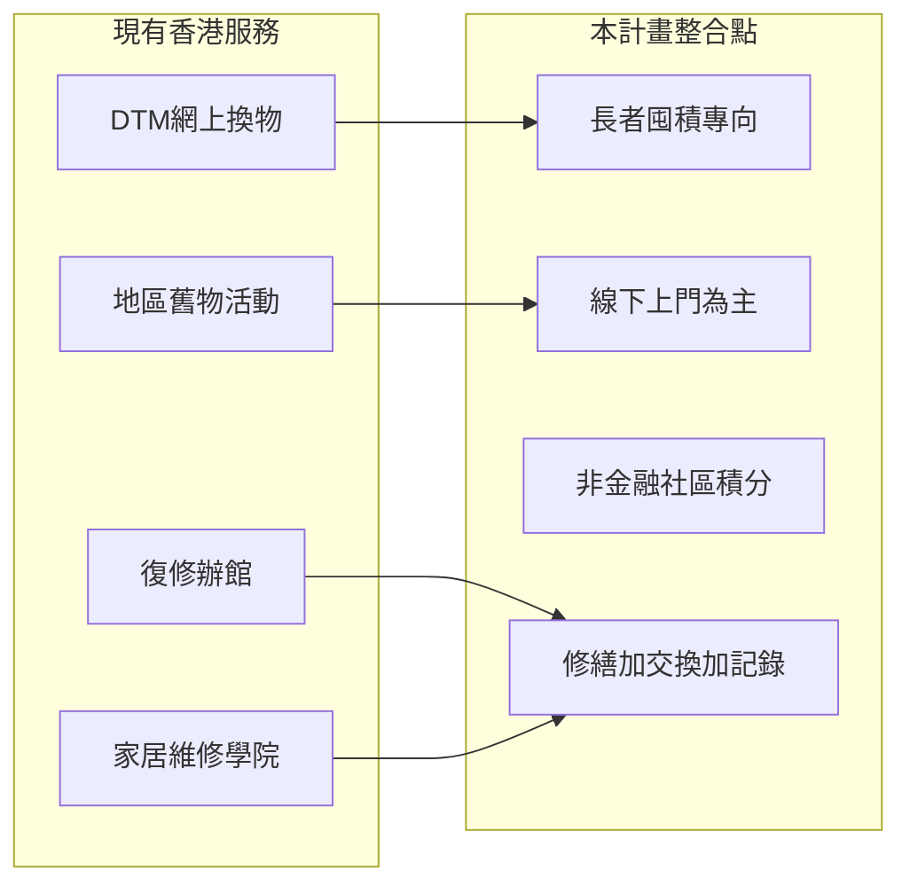

# 香港本地服務參考

本文件整理與本計畫相關的香港現有服務，供計畫書引用、伙伴洽談及差異化定位。連結最後查閱：2026年5月。

---

## 參考清單

| 機構／項目 | 連結 | 類型 |
|------------|------|------|
| Don't Throw Me Limited（DTM） | [以物易物服務](https://dontthrowme.com/zh-Hant/service/swap) | 網上以物易物平台 |
| 屯門拍檔・舊物漂流 | [Threads 帖文](https://www.threads.com/@tum.pakdong/post/DYmqg7Wk9lU) | 地區性舊物交換／社區活動 |
| 哈爾移動椅子（howlsmovingchair） | [Instagram](https://www.instagram.com/p/DXRpAlgDVgC/) | 社區取材、椅子翻新、生活達人故事 |
| 深水埗社區實驗 | [Instagram](https://www.instagram.com/p/DXRpAlgDVgC/) | 社區實驗／在地活動（同哈爾移動椅子項目） |
| 復修辦館 | [Instagram @repaircafe_hk](https://www.instagram.com/repaircafe_hk/) | 復修咖啡室（Repair Café）模式 |
| 家居維修學院（家居維修義工協會） | [維修課程](https://www.repairfairyhk.com/repairCourse/repairCourse.html) | 家居維修培訓與義工 |

---

## 各項服務摘要

### 1. Don't Throw Me Limited（DTM）

**模式**：網上平台以物易物；用戶註冊後以 **DTM 點數**（1 點 = 1 港元）為物品定價、瀏覽市集、結帳交換；可增值點數，累積至 500 點可兌換現金；部分交易可捐予合作慈善機構。

**強項**

- 降低第三方支付成本、交易流程清晰  
- 結合慈善捐助，具社會效益敘事  
- 物品類別由用戶自訂，流動性高  

**與本計畫差異**

| 維度 | DTM | 本計畫 |
|------|-----|--------|
| 主要對象 | 熟悉網絡的一般用戶 | **囤積物品長者** |
| 渠道 | 全線上、需自行發佈與議價 | **上門、義工代辦、屋邨交換日** |
| 積分 | 近似貨幣、可增值及兌現金 | **社區感謝積分，不可兌現金** |
| 定價 | 用戶為物品標價（港元等值） | **不以積分強迫估價** |
| 修繕 | 非主軸 | **修繕先行、上門配對** |
| 心理安全 | 一般二手平台體驗 | **去標籤、暫存待領、試水溫** |

**可借鑑**：主題活動宣傳節奏、與慈善機構連結的敘事（本計畫改為社區感謝積分及實物回饋，避免儲值屬性）。

---

### 2. 屯門拍檔・舊物漂流

**模式**（依公開社區宣傳）：地區團體「屯門拍檔」推動的**舊物漂流**活動，強調社區內物品再流通、街坊參與，屬**在地化、活動式**交換，而非全港性網平台。

**與本計畫關係**

- 與「**每月主題交換日**」高度同類，可作試點營運參考  
- 本計畫可額外加上：長者專向流程、積分紀錄、修繕攤、上門及代登記  

**合作方向**：若試點於屯門，可洽談聯辦主題日或共用義工網絡。

---

### 3. 哈爾移動椅子（howlsmovingchair）／深水埗社區實驗

**模式**（依公開帖文）：**「哈爾移動椅子」**（howlsmovingchair）從社區中取材，收集有殘缺或閒置嘅椅子，找出深水埗街頭巷尾中嘅生活達人，與社區夥伴一同翻新椅子，並以**「一椅一達人」**方式記錄生活達人嘅技能同故事。項目亦以「深水埗社區實驗」名義發布活動資訊。

**與本計畫關係**

- 示範「地區 + 社區取材 + 升級改造 + 達人故事」嘅推廣方式  
- 本計畫需補足：長者非社媒主力（電話／上門優先）、系統化積分同修繕 SOP、上門修繕安全流程  

**合作方向**：深水埗試點時可參考其社區動員同改造攤設計；聯辦升級改造攤或達人分享環節。

---

### 4. 復修辦館（Repair Café Hong Kong）

**模式**：國際 **Repair Café** 理念於香港的實踐——定期聚會，義工／技工協助**即場修復**物品，延長壽命、減少棄置；以 Instagram 等渠道發布活動。

**強項**

- 修復文化、社區聚會、技能分享  
- 與本計畫「**修繕攤／工作坊**」直接呼應  

**與本計畫差異**

| 維度 | 復修辦館 | 本計畫 |
|------|----------|--------|
| 場景 | 定期聚會、帶物品到攤位 | **上門修繕** + 交換日攤位 |
| 對象 | 廣泛社區 | **長者囤積**專向、雙人上門安全 |
| 後續 | 修完帶走 | 修後可銜接**交換釋出**、暫存待領 |
| 紀錄 | 活動為主 | 積分、修繕單狀態、KPI |

**合作方向**：聯合舉辦屋邨修繕日、師傅／義工互認、培訓教材共用。

---

### 5. 家居維修學院（家居維修義工協會 / Repair Fairy）

**模式**：自 2015 年起提供**水工、木工、電工、鎖王**等家居維修課程；學員近 1,500 人、課程逾 100 項；強調專業技能、義工團隊及「中年轉機」就業支援；設 WhatsApp 聯絡（6131 2311）。

**強項**

- 系統化培訓**家居維修人才**  
- 義工文化與「取之社會、用之社會」  

**與本計畫關係**

- 本計畫「**修繕師傅／技工**」供應端可參考其學員／義工作為合作池  
- 高風險工程（電力內部、氣體）須符合其專業範疇及本計畫禁制清單  
- 長者**上門**服務仍須配合中心雙人義工與保險 SOP，非取代專業承判  

**合作方向**：為中心職員或義工開設**基礎檢查班**；轉介複雜個案予合資格技工；避免義工越權處理危險工程。

---

## 本計畫的定位（綜合）

**一句話定位**：本計畫**不是**另一個全港二手 App，而是把「地區交換活動 + Repair Café 修繕 + 技工培訓」整合為**長者友善、可上門、可代辦、可漸進釋出**的屋邨服務，並以非金融積分與後台紀錄支援持續營運與資助申報。

---

## 建議引用方式（計畫書用）

> 香港已有 Don't Throw Me 等網上以物易物平台，以及復修辦館、家居維修學院等修繕相關服務；地區團體亦舉辦如屯門「舊物漂流」等社區交換活動。惟針對**囤積物品長者**、結合**上門關懷、義工代辦、非儲值積分及修繕—交換銜接**的系統化屋邨服務仍屬缺口。本計畫擬與上述服務**互補而非重複**，並在試點區與地區團體及修繕伙伴協作。

---

## 附錄：洽談伙伴檢查清單

- [ ] 試點是否鄰近屯門／深水埗等已有社區活動？可聯辦或分工  
- [ ] 修繕攤是否可邀復修辦館或家居維修義工協會支援？  
- [ ] 積分制度是否與 DTM 等商業點數劃清（非儲值、非兌現金）？  
- [ ] 上門修繕工程範圍是否寫入 MOU（禁制高風險項目）？  
