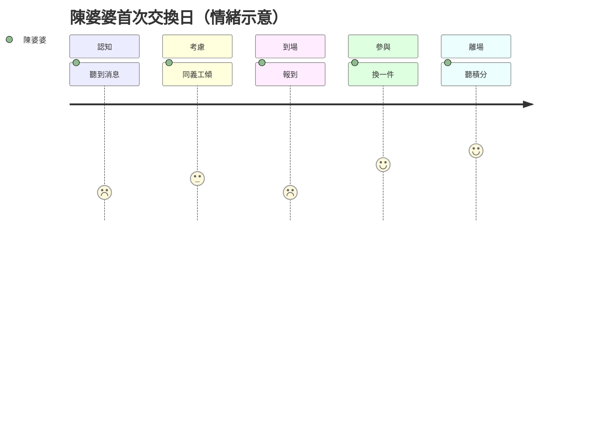

# User Journey Map（使用者旅程圖）

**項目**：社區循環經濟與升級改造平台  
**版本**：1.0  
**文件語言**：繁體中文（香港書面語）  
**相關文件**：[user-journeys.md](user-journeys.md)（技術步驟）、[user-personas.md](user-personas.md)、[empathy-maps.md](empathy-maps.md)

> **同 [user-journeys.md](user-journeys.md) 嘅分別**  
> - **本文件**：UX 視角 — 情緒、想法、痛點、設計機會  
> - **user-journeys.md**：營運／系統視角 — 角色、渠道、實體、序列圖、埋點

---

## 1. 旅程圖結構

每段旅程包含：

| 欄位 | 說明 |
|------|------|
| **階段** | 時間順序上嘅關鍵節點 |
| **用户行為** | Persona 做咩 |
| **觸點／渠道** | 邊度、用咩媒介 |
| **想法（Think）** | 內心對白 |
| **情緒** | 😟 低 → 😊 高 |
| **痛點** | 摩擦、風險 |
| **機會／設計回應** | 產品、服務、話術 |

---

## 2. 主旅程 J-A：陳婆婆首次參加主題交換日

**Persona**：陳婆婆（主）、阿玲（義工）、李姑娘（職員）  
**目標**：無壓力完成首次接觸，建立信任  
**觸發**：面邀／電話／屋邨海報  
**對應技術旅程**：[user-journeys.md](user-journeys.md) §2

| 階段 | 用户行為 | 觸點／渠道 | 想法（Think） | 情緒 | 痛點 | 機會／設計回應 |
|------|----------|------------|---------------|------|------|----------------|
| **1. 認知** | 聽到交換日消息 | 電話、上門、屋邨海報 | 「又係咪要執屋？」 | 😟 2 | 標籤化用字 | 海報：「帶一件嚟都得」「分享舊物故事」 |
| **2. 考慮** | 同義工傾計 | 家訪、電話 | 「去睇下先，唔使換嘢？」 | 😐 3 | 怕當眾出醜 | 強調試水溫、歡迎參觀有積分（E-05） |
| **3. 報名** | 同意參加 | 義工代報、後台 | 「阿玲幫我報，我唔使自己搞。」 | 🙂 3 | 唔識 App | 代報名 + 社區編號；ProxyRegistration |
| **4. 準備** | 揀 1 件衫 | 家中 | 「帶一件就好，唔使一次過。」 | 🙂 4 | 搬運困難 | 義工可上門收一件 |
| **5. 到場** | 到會堂報到 | 現場、紙本／後台 | 「好多人，會唔會睇我？」 | 😟→🙂 2→4 | 人多退縮 | 靜區、一對一義工、熟識職員迎接 |
| **6. 參與** | 參觀或換一件 | 交換攤、故事角 | 「原來唔使估價。」 | 😊 4 | 被迫即棄 | 暫存待領（ItemHold P1） |
| **7. 離場** | 聽積分、攞卡 | 口頭、紙本卡 | 「做咗好事有積分，幾好。」 | 😊 5 | 聽不清 | 大字卡、義工讀出結餘 |
| **8. 跟進** | 接關懷電話 | 電話 | 「下個月再嚟睇下。」 | 🙂 4 | 無人跟進 | 3 日後提醒下次日期（N-01） |

### 2.1 情緒曲線

| 階段 | 1 認知 | 2 考慮 | 3 報名 | 4 準備 | 5 到場 | 6 參與 | 7 離場 | 8 跟進 |
|------|--------|--------|--------|--------|--------|--------|--------|--------|
| 情緒（1–5） | 2 | 3 | 3 | 4 | 2→4 | 4 | 5 | 4 |

*到場時情緒可能先跌（緊張），參與後回升 — 設計要預留「緩衝區」。*

### 2.2 關鍵 Moment of Truth

| Moment | 成敗關鍵 | 設計 Must-have |
|--------|----------|----------------|
| 首次聽到邀請 | 用字是否去標籤 | 話術培訓、海報審稿 |
| 到場頭 5 分鐘 | 有無被即場要求清屋 | 靜區 + 一對一義工 |
| 離場時 | 有無被感謝、有無積分 | 口頭 + 紙本大字 |

---

## 3. 次旅程 J-B：修繕後再決定

**Persona**：陳婆婆、強哥、阿玲  
**目標**：尊重惜物；修繕完成後**自主**決定留用或釋出  
**觸發**：「壞咗唔捨得丟」  
**對應**：[user-journeys.md](user-journeys.md) §3

| 階段 | 用户行為 | 觸點 | 想法 | 情緒 | 痛點 | 機會 |
|------|----------|------|------|------|------|------|
| **求助** | 表達風扇壞咗 | 家訪、電話 | 「丟咗好可惜。」 | 😟 2 | 唔知邊度修 | 義工代建 RepairRequest |
| **預約** | 約上門時間 | 後台、電話 | 「陌生人入屋安唔安全？」 | 😐 3 | 怕陌生人 | 雙人義工、穿證、家人知情 |
| **維修** | 師傅上門 | 現場 | 「真係修到？！」 | 🙂→😊 3→5 | 無位、禁制工程 | 禁制清單；說明保養 |
| **決定** | 留用或考慮釋出 | 電話、下月交換日 | 「我再用吓先。」 | 😊 4 | 被催交換 | **自主決定**；輕柔邀請 |
| **釋出（可選）** | 帶去交換日 | J-A 流程 | 「修好了，送俾有需要嘅人。」 | 😊 5 | — | 修繕完成積分 + 釋出積分 |

---

## 4. 輔助旅程 J-C：義工代操作

**Persona**：陳婆婆、阿玲  
**目標**：長者全程無需 PWA，仍享有完整積分  
**對應**：[user-journeys.md](user-journeys.md) §4

| 階段 | 行為 | 觸點 | 情緒 | 痛點 | 機會 |
|------|------|------|------|------|------|
| 表達意願 | 致電中心／家訪 | 電話 | 🙂 | 唔識操作 | 義工接聽 SOP |
| 查找／建立档案 | 社區編號 | 後台 | — | 資料分散 | 一個編號貫通 |
| 代報名／代登記 | 口頭描述物品 | 後台 ≤3 步 | 🙂 | 步驟太多 | 簡化代登記 |
| 積分發放 | 口頭讀出 | 紙本卡 | 😊 | 聽不清 | 大字卡 |
| 提示 | 活動前電話 | 電話 | 🙂 | 無提醒 | 電話優先推送 |

---

## 5. 輔助旅程 J-D：家人陪同首次

**Persona**：美儀、陳婆婆、李姑娘  
**對應**：[user-journeys.md](user-journeys.md) §5

| 階段 | 行為 | 觸點 | 情緒 | 痛點 | 機會 |
|------|------|------|------|------|------|
| 查詢 | 女兒致電中心 | 電話 | 😐 | 唔知渠道 | 統一熱線／中心窗口 |
| 授權 | 長者口頭同意 | 電話／現場 | 🙂 | 自主權爭議 | 記錄 family_user_id + 同意 |
| 陪同到場 | 母女一齊 | 現場 | 😟→🙂 | 女兒想代決定 | 登記以**長者意願**為準 |
| 通知 | WhatsApp 下次活動 | WhatsApp | 🙂 | opt-in 唔清晰 | 長者同意後才發家人 |

---

## 6. 輔助旅程 J-E：暫存待領

**Persona**：陳婆婆、阿玲  
**對應**：[user-journeys.md](user-journeys.md) §6

| 階段 | 行為 | 觸點 | 情緒 | 痛點 | 機會 |
|------|------|------|------|------|------|
| 到場未決定 | 帶物品但猶豫 | 現場 | 😟 2 | 當場被迫決定 | 解釋暫存選項 |
| 暫存 | 交中心保管 | ItemHold／紙本 | 🙂 3 | 怕物品唔見 | 儲位標籤、雙人確認 |
| 下次決定 | 取回或釋出 | 下次活動 | 😊 4 | 忘記 | 到期前 7 日電話 |
| 逾期 | 依政策處理 | 電話 | 😐 | 信任受損 | 透明政策、提前提醒 |

---

## 7. 旅程與功能對照總表

| 旅程 | Persona 主導 | 核心功能 | 關鍵實體 | 詳見 |
|------|--------------|----------|----------|------|
| J-A 首次交換日 | 陳婆婆 | 交換日、積分、推送 | Event, ItemListing, Wallet | 本文件 §2 |
| J-B 修繕後交換 | 陳婆婆、強哥 | 修繕工作坊 | RepairRequest | 本文件 §3 |
| J-C 義工代操作 | 陳婆婆、阿玲 | 代登記、紙本卡 | ProxyRegistration | 本文件 §4 |
| J-D 家人陪同 | 美儀、陳婆婆 | 授權、推送 | family_user_id | 本文件 §5 |
| J-E 暫存待領 | 陳婆婆 | ItemHold | ItemHold | 本文件 §6 |
| J-F 轉介 | 李姑娘 | （線外） | — | [user-journeys.md](user-journeys.md) §7 |

---

## 8. 觸點優先序（旅程設計用）

| 優先 | 觸點 | 適用旅程 | 一期 |
|------|------|----------|------|
| 1 | 電話／上門 | J-A, J-C, J-B | ✓ 主 |
| 2 | 屋邨海報／告示 | J-A | ✓ |
| 3 | 現場紙本 | J-A, J-C, J-E | ✓ 主 |
| 4 | 中心後台 | 全部 | ✓ MVP |
| 5 | WhatsApp（家人） | J-D | ✓ 人工 |
| 6 | PWA | J-A（可選查積分） | 一期可選 |

---

## 9. 空白 User Journey 模板

**旅程名稱**：________________  
**Persona**：________________  
**目標**：________________

| 階段 | 行為 | 觸點 | 想法 | 情緒 1–5 | 痛點 | 機會 |
|------|------|------|------|----------|------|------|
| 1. | | | | | | |
| 2. | | | | | | |
| 3. | | | | | | |
| 4. | | | | | | |
| 5. | | | | | | |

**情緒最低點階段**：________________  
**設計 Must-have（3 項）**：

1.  
2.  
3.  

---

## 10. 相關文件

| 檔案 | 用途 |
|------|------|
| [user-journeys.md](user-journeys.md) | 逐步流程、序列圖、埋點 |
| [actionable-insights.md](actionable-insights.md) | 從旅程痛點提煉洞察 |
| [impact-matrix.md](impact-matrix.md) | 功能優先排序 |
