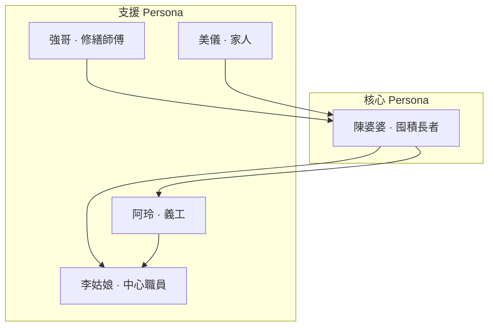

# 使用者人物誌（User Personas）

**項目**：社區循環經濟與升級改造平台（香港交換市集及修繕服務）  
**版本**：1.0  
**文件語言**：繁體中文（香港書面語）  
**相關文件**：[empathy-maps.md](empathy-maps.md)、[user-journey-map.md](user-journey-map.md)、[PRD.md](PRD.md) §2

---

## 1. 什麼是人物誌？點解需要？

**使用者人物誌（User Persona）** 係基於真實需求整理出嚟嘅**假想代表用户**，幫設計、營運同義工團隊喺做決定時記住：「我哋係為邊個設計？」

本項目主敘事圍繞**有囤積物品傾向嘅長者**，但服務要落地，必須同時理解義工、職員、師傅同家人嘅角色。

---

## 2. 主 Persona：陳婆婆（72 歲）

### 2.1 基本資料

| 項目 | 內容 |
|------|------|
| **姓名** | 陳美玲（陳婆婆） |
| **年齡** | 72 歲 |
| **居住** | 公共屋邨，獨居，行動稍慢，上落樓梯需時 |
| **家庭** | 一女（美儀，48 歲，住另一區）；偶爾探訪 |
| **數碼** | 有舊式手機，主要接聽電話；唔用 WhatsApp |
| **收入** | 長者生活津貼；節儉，惜物 |

### 2.2 物品與行為

- 衣櫃有多年未著嘅衫、壞咗閘掣嘅電風扇、孫輩舊玩具、報紙雜誌
- 心態：「修好還能用」「總有一天會用到」「丟咗好可惜」
- 唔識自己修；唔信任網上二手平台；怕陌生人上門

### 2.3 目標與動機

| 類型 | 內容 |
|------|------|
| **功能目標** | 慢慢整理空間；修好電風扇；搵人幫手處理閒置物 |
| **情感目標** | 唔想被人話「囤積」「執屋」；想有街坊陪；想感覺自己仲有用 |
| **社交目標** | 識多兩個同屋邨街坊；有固定理由出門 |

### 2.4 挫折與恐懼

- 聽到「斷捨離」「清理」「囤積症」會防備同抗拒
- 怕當眾出醜；怕物品被估價後睇低
- 怕當日被迫即棄；怕子女嫌棄自己唔識執屋
- 出入不便，難以帶重物到區外維修或回收

### 2.5 典型語錄

> 「我唔係唔捨得丟，係覺得仲有用。」  
> 「帶一件嚟都得？我試下先。」  
> 「阿玲幫我報就得，我唔識㩒電話。」

### 2.6 成功指標（設計驗證）

| 指標 | 目標 |
|------|------|
| 3 個月內自願參加活動 | ≥ 2 次 |
| 單次釋出件數 | 1～3 件，唔引起抗拒 |
| 首次參與形式 | 允許「只參觀」 |
| 數碼接觸 | 全程可唔用 App，仍享有完整積分 |

### 2.7 設計含義

- **渠道**：電話、上門、屋邨海報優先；PWA 為輔
- **文案**：用「分享、交換、修好再用」，避免「執屋、清理」
- **流程**：義工代辦、試水溫參觀、暫存待領、修繕先行
- **情緒**：到場一對一義工、熟識職員迎接、唔迫即決定

---

## 3. 義工 Persona：阿玲（45 歲）

### 3.1 基本資料

| 項目 | 內容 |
|------|------|
| **背景** | 退休前文員；每週義工 2 日 |
| **數碼** | 会用 WhatsApp；後台要簡單清晰 |
| **角色** | 長者與系統之間嘅「橋樑」 |

### 3.2 目標與挫折

| 目標 | 挫折 |
|------|------|
| 幫長者順利登記、有面子地分享 | 活動人多時系統慢或斷網 |
| 準確記錄積分 | 唔知邊啲品項禁制修繕 |
| 唔使人尷尬 | 長者臨時退縮，不知如何安慰 |

### 3.3 典型語錄

> 「陳婆婆，我幫你登記，你話我聽就得。」  
> 「我想幫佢哋有面子地分享，唔係幫佢哋執屋。」

### 3.4 設計含義

- 代登記 ≤ 3 步；紙本後備 SOP
- 現場大字積分顯示；義工可代讀結餘
- 修繕禁制清單一頁紙；靜區引導退縮長者

---

## 4. 中心職員 Persona：李姑娘（38 歲）

### 4.1 基本資料

| 項目 | 內容 |
|------|------|
| **角色** | 長者地區中心活動統籌 |
| **職責** | 策劃交換日、派修繕單、積分發放、個案跟進、資助報告 |

### 4.2 目標與挫折

| 目標 | 挫折 |
|------|------|
| 每月順利搞交換日 | 師傅臨時唔得閒 |
| KPI 達標、個案安全 | 資助報告趕 deadline |
| 睇到邊個長者幾時未嚟 | 多系統來回、報表手工整理 |

### 4.3 典型語錄

> 「本月主題係童玩，我哋逐個電話邀請。」  
> 「我要睇到邊個長者幾時未嚟，方便我打電話關懷。」

### 4.4 設計含義

- 後台：報到列表、修繕派單、參與報表（P1）
- 活動後 3 日關懷提醒列表
- 嚴重個案轉介流程線外清晰，平台唔做診斷

---

## 5. 修繕師傅 Persona：強哥（58 歲）

### 5.1 基本資料

| 項目 | 內容 |
|------|------|
| **技能** | 小型家電、家具簡單維修 |
| **限制** | 唔做電力內部、氣體相關等高危工程 |
| **服務** | 以上門修繕為主 |

### 5.2 目標與挫折

| 目標 | 挫折 |
|------|------|
| 準時上門、清楚單據 | 屋邨地址難找 |
| 修到就修，修唔到講清楚 | 長者屋企物品多，無位開工 |
| 唔被誤解為「執屋」 | 被催交換釋出物品 |

### 5.3 典型語錄

> 「我修到就修，修唔到我都會講清楚點處理。」

### 5.4 設計含義

- 修繕單狀態清晰（待派、已約、完成、無法修）
- 上門必須雙人義工、穿證、預約制
- 完成後由**長者自主決定**留用或釋出，唔強推交換

---

## 6. 家人 Persona：美儀（48 歲）

### 6.1 基本資料

| 項目 | 內容 |
|------|------|
| **關係** | 陳婆婆之女 |
| **居住** | 另一區；平日上班 |
| **數碼** | 常用 WhatsApp |

### 6.2 目標與挫折

| 目標 | 挫折 |
|------|------|
| 幫媽媽安全釋出部分物品 | 擔心媽媽被標籤「囤積」 |
| 唔傷媽媽自尊 | 自己想「幫佢執」但被拒絕 |
| 接收活動通知（經媽媽同意） | 唔知邊個渠道正式、邊個係義工 |

### 6.3 典型語錄

> 「我想佢安全，但唔想佢覺得子女嫌棄佢。」

### 6.4 設計含義

- 代報名須**長者口頭同意**；登記以長者意願為準
- 通知可發家人 WhatsApp（opt-in）
- 職員必要時調停「強制清屋」壓力

---

## 7. 次要 Persona（簡表）

| Persona | 角色 | 需求摘要 | 優先 |
|---------|------|----------|------|
| 街坊（接收方） | 交換對象 | 搵合用二手物、認識鄰里 | 低（非主敘事） |
| 平台管理員 | 審核、KPI | 多據點報表、師傅審核 | P2／三期 |

---

## 8. 人物誌優先級（設計焦點）

| 優先 | Persona | 原因 | 主要旅程 |
|------|---------|------|----------|
| **1** | 陳婆婆 | 主服務對象；囤積議題核心 | J-A、J-B、J-E |
| **2** | 阿玲 | 代操作樞紐；決定長者現場體驗 | J-C |
| **3** | 李姑娘 | 營運成敗、安全、KPI | 全部旅程承辦 |
| **4** | 強哥 | 修繕旅程關鍵伙伴 | J-B |
| **5** | 美儀 | 常見首次參與觸發者 | J-D |

---

## 9. 人物誌 × 服務功能對照

| Persona | 最在意 | 對應核心功能 |
|---------|--------|--------------|
| 陳婆婆 | 低壓力、有面子 | 主題交換日、暫存待領、修繕先行 |
| 阿玲 | 快、準、唔尷尬 | 代登記、紙本卡、禁制清單 |
| 李姑娘 | 順暢、可報告 | 後台、推送、修繕派單 |
| 強哥 | 清晰、安全 | 修繕單、上門 SOP |
| 美儀 | 尊重媽媽自主 | 授權記錄、家人通知 |

---

## 10. 工作坊用：空白人物誌模板

複製下表，訪談或觀察後填寫：

| 項目 | 內容 |
|------|------|
| 姓名／代號 | |
| 年齡／居住 | |
| 一句話 | |
| 目標 | |
| 挫折／恐懼 | |
| 典型語錄（3 句） | |
| 成功指標 | |
| 設計含義（3 點） | |

---

## 11. 相關文件

| 檔案 | 用途 |
|------|------|
| [empathy-maps.md](empathy-maps.md) | 各 Persona 同理心地圖 |
| [user-journey-map.md](user-journey-map.md) | 體驗旅程圖 |
| [user-journeys.md](user-journeys.md) | 技術步驟與序列圖 |
| [ux-design-kit.md](ux-design-kit.md) | UX 工具包總覽 |
