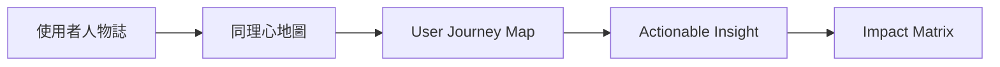
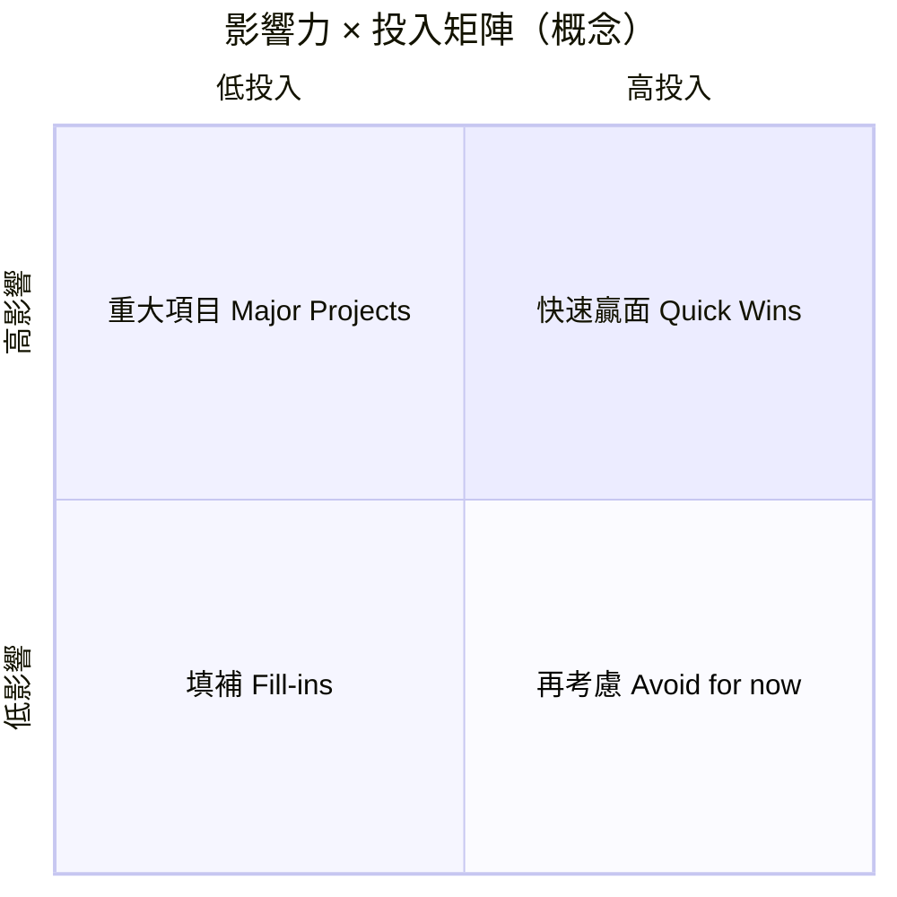

# UX 設計工具包

**項目**：社區循環經濟與升級改造平台（香港交換市集及修繕服務）  
**版本**：1.0  
**文件語言**：繁體中文（香港書面語）  
**相關文件**：[PRD.md](PRD.md)、[user-journeys.md](user-journeys.md)、[PRD-executive.md](PRD-executive.md)

本文件為 **UX 設計工具包總覽**；各章節詳細內容已分拆為獨立文件，方便閱讀、列印同工作坊使用。  
流程建議：**人物誌 → 同理心地圖 → 旅程圖 → 洞察捕捉 → 影響力矩陣**。

---

## 目錄

| # | 章節 | 獨立文件 |
|---|------|----------|
| 1 | 使用者人物誌（User Personas） | [user-personas.md](user-personas.md) |
| 2 | 同理心地圖（Empathy Maps） | [empathy-maps.md](empathy-maps.md) |
| 3 | User Journey Map | [user-journey-map.md](user-journey-map.md) |
| 4 | Actionable Insight Capture | [actionable-insights.md](actionable-insights.md) |
| 5 | Impact Matrix（影響力 × 投入矩陣） | [impact-matrix.md](impact-matrix.md) |

> 以下 §1–§5 為**摘要版**；完整內容請開啟上表獨立文件。

1. [使用者人物誌（User Personas）](#1-使用者人物誌user-personas)
2. [同理心地圖（Empathy Maps）](#2-同理心地圖empathy-maps)
3. [User Journey Map](#3-user-journey-map)
4. [Actionable Insight Capture](#4-actionable-insight-capture)
5. [Impact Matrix（影響力 × 投入矩陣）](#5-impact-matrix影響力--投入矩陣)

---

## 1. 使用者人物誌（User Personas）

人物誌係**假想但基於真實需求**嘅代表用户，幫團隊記住「為邊個設計」。

### 1.1 陳婆婆 — 主服務對象（囤積物品長者）

| 項目 | 內容 |
|------|------|
| **年齡** | 72 歲 |
| **居住** | 公共屋邨，獨居，行動稍慢 |
| **數碼** | 有舊式手機 mainly 接聽；唔用 WhatsApp |
| **物品** | 衣櫃、電風扇、孫輩舊玩具；覺得「仲用得」「總有一天會用到」 |
| **目標** | 慢慢整理、修好電風扇、識多兩個街坊 |
| **挫折** | 怕被人話「囤積」「執屋」；唔識修；唔信任網上二手平台 |
| **一句話** | 「我唔係唔捨得丟，係覺得仲有用。」 |
| **成功指標** | 3 個月內自願參加 ≥2 次活動；單次釋出 1～3 件而唔抗拒 |

**設計含義**：上門、電話、義工代辦；試水溫參觀；唔估價、唔迫決定。

---

### 1.2 阿玲 — 社區義工

| 項目 | 內容 |
|------|------|
| **年齡** | 45 歲 |
| **背景** | 退休前文員；每週義工 2 日 |
| **數碼** | 会用 WhatsApp；後台要簡單 |
| **目標** | 幫長者順利登記、唔使人尷尬 |
| **挫折** | 活動人多時系統慢；唔知邊啲品項禁制修繕 |
| **一句話** | 「我想幫佢哋有面子地分享，唔係幫佢哋執屋。」 |

**設計含義**：代登記 ≤3 步；紙本後備；現場大字積分顯示；禁制清單一頁紙。

---

### 1.3 李姑娘 — 中心職員／活動承辦

| 項目 | 內容 |
|------|------|
| **年齡** | 38 歲 |
| **角色** | 長者地區中心活動統籌 |
| **目標** | 每月順利搞交換日、KPI 達標、個案安全 |
| **挫折** | 資助報告趕 deadline；師傅臨時唔得閒 |
| **一句話** | 「我要睇到邊個長者幾時未嚟，方便我打電話關懷。」 |

**設計含義**：後台報到列表、修繕派單、長者參與報表（P1）；轉介流程線外清晰。

---

### 1.4 強哥 — 修繕師傅

| 項目 | 內容 |
|------|------|
| **年齡** | 58 歲 |
| **技能** | 小型家電、家具簡單維修；唔做電力內部 |
| **目標** | 準時上門、清楚單據、唔被誤解為「執屋」 |
| **挫折** | 地址難找；長者屋企物品多無位开工 |
| **一句話** | 「我修到就修，修唔到我都會講清楚點處理。」 |

**設計含義**：修繕單狀態清晰；上門雙人義工；禁制品項標示；三期可選師傅 PWA。

---

### 1.5 美儀 — 長者女兒（家人）

| 項目 | 內容 |
|------|------|
| **年齡** | 48 歲 |
| **居住** | 另一區；平日上班 |
| **目標** | 幫媽媽安全釋出部分物品，又唔傷自尊 |
| **挫折** | 擔心媽媽被標籤；自己想「幫佢執」但被拒絕 |
| **一句話** | 「我想佢安全，但唔想佢覺得子女嫌棄佢。」 |

**設計含義**：代報名須長者同意；通知可發家人 WhatsApp；職員調停「強制清屋」壓力。

---

### 1.6 人物誌優先級（設計焦點）

| 優先 | Persona | 原因 |
|------|---------|------|
| 1 | 陳婆婆 | 主服務對象，所有旅程圍繞佢 |
| 2 | 阿玲 | 代操作樞紐，影響長者體驗 |
| 3 | 李姑娘 | 後台與營運成敗 |
| 4 | 強哥 | 修繕旅程關鍵伙伴 |
| 5 | 美儀 | 次要但常見觸發首次參與 |

---

## 2. 同理心地圖（Empathy Maps）

同理心地圖幫團隊**代入用户**嘅說、想、做、感受。  
每個 Persona 一張；工作坊可列印空白模板填寫。

### 2.1 陳婆婆 — 同理心地圖

| | **外在（可觀察）** | **內在** |
|---|-------------------|----------|
| **說／做** | **說**：「呢件衫仲新…」「帶一件嚟都得？我試下。」 **做**：留壞電器、接中心電話、由義工帶一件去會堂 | **想**：驚被睇低、驚子女話唔照顧；想有人陪 **感受**：受邀抗拒 → 到場放鬆 → 被感謝有面子 |
| **聽／睇** | **聽**：電視斷捨離、物管消防、街坊話「唔使執屋」 **睇**：海報「帶一件即可」、熟識職員、街坊換到合用物 | （同上內在欄） |

**痛點（Pains）** · 缺乏修繕技能 · 數碼障礙、怕估價 · 怕標籤「囤積」· 當場被迫決定  

**收穫（Gains）** · 低壓力釋出仍被感謝 · 上門修好風扇 · 認識街坊、固定聚會

---

### 2.2 阿玲（義工）— 同理心地圖

| 象限 | 內容 |
|------|------|
| **說** | 「陳婆婆，我幫你登記，你話我聽就得。」「今日人多，我哋去靜啲嘅位。」 |
| **想** | 要快又唔使人難堪；唔好記錯積分 |
| **做** | 代填表、帶長者報到、讀積分、上門收件 |
| **感受** | 見到長者笑會開心；系統 lag 時焦慮 |
| **痛點** | 斷網；長者臨時退縮；唔知修繕禁制 |
| **收穫** | 後台 3 步完成代登記；紙本後備；清晰 SOP |

---

### 2.3 李姑娘（中心職員）— 同理心地圖

| 象限 | 內容 |
|------|------|
| **說** | 「本月主題係童玩，我哋逐個電話邀請。」「師傅，下星期三上門。」 |
| **想** | KPI、安全、個案唔好出錯 |
| **做** | 建活動、派單、發積分、轉介、寫報告 |
| **感受** | 活動順利有成就感；嚴重個案擔心 |
| **痛點** | 師傅檔期；報表趕工；多系統來回 |
| **收穫** | 一個後台睇晒報到、修繕、積分 |

---

### 2.4 空白同理心地圖模板（工作坊用）

複製下表，每組揀一個 Persona 填寫：

| | **說 Says** | **做 Does** |
|---|-------------|-------------|
| **想 Thinks** | | |
| **感受 Feels** | | |

| **痛點 Pains** | **收穫 Gains** |
|----------------|----------------|
| | |

---

## 3. User Journey Map

旅程圖描述用户**隨時間**嘅體驗：做咩、用咩渠道、諗咩、情緒、痛點、機會。  
以下主旅程對齊 [user-journeys.md](user-journeys.md) J-A；技術步驟見該文件。

### 3.1 主旅程：陳婆婆首次參加主題交換日

**目標**：無壓力完成首次接觸，建立信任。  
**對應**：J-A

| 階段 | 用户行為 | 觸點／渠道 | 想法（Think） | 情緒 😟→😊 | 痛點 | 機會／設計回應 |
|------|----------|------------|---------------|------------|------|----------------|
| **1. 認知** | 聽到交換日消息 | 電話、上門、屋邨海報 | 「又係咪要執屋？」 | 😟 抗拒 | 標籤化用字 | 海報：「帶一件嚟都得」「分享」 |
| **2. 考慮** | 同義工傾計 | 家訪、電話 | 「去睇下先，唔使換嘢？」 | 😐 猶豫 | 怕當眾出醜 | 強調試水溫、歡迎參觀有積分 |
| **3. 報名** | 同意參加 | 義工代報、後台 | 「阿玲幫我報，我唔使自己搞。」 | 🙂 稍安 | 唔識 App | 代報名 + 社區編號 |
| **4. 準備** | 揀 1 件衫 | 家中 | 「帶一件就好，唔使一次過。」 | 🙂 | 搬運困難 | 義工可上門收一件 |
| **5. 到場** | 到會堂報到 | 現場、紙本／後台 | 「好多人，會唔會睇我？」 | 😟→🙂 | 人多退縮 | 靜區、一對一義工 |
| **6. 參與** | 參觀或換一件 | 交換攤 | 「原來唔使估價。」 | 😊 | 被迫即棄 | 暫存待領（P1） |
| **7. 離場** | 聽積分、攞卡 | 口頭、紙本卡 | 「做咗好事有積分，幾好。」 | 😊 | 聽不清 | 大字卡、義工讀出 |
| **8. 跟進** | 接關懷電話 | 電話 | 「下個月再嚟睇下。」 | 🙂 | 無人跟進 | 3 日後提醒下次日期 |

#### 情緒曲線（示意）

| 階段 | 認知 | 考慮 | 報名 | 準備 | 到場 | 參與 | 離場 | 跟進 |
|------|------|------|------|------|------|------|------|------|
| 情緒（1=低 5=高） | 2 | 3 | 3 | 4 | 2→4 | 4 | 5 | 4 |

*到場時情緒可能先跌（緊張），參與後回升。*

---

### 3.2 次旅程：修繕後再決定（J-B）

| 階段 | 用户行為 | 觸點 | 情緒 | 痛點 | 機會 |
|------|----------|------|------|------|------|
| 求助 | 「風扇壞咗唔捨得丟」 | 家訪、電話 | 😟 | 唔知邊度修 | 義工代建修繕單 |
| 預約 | 約上門 | 後台 | 😐 | 怕陌生人入屋 | 雙人義工、家人知情 |
| 維修 | 師傅上門 | 現場 | 🙂→😊 | 無位、禁制工程 | 禁制清單、說明保養 |
| 決定 | 留用或釋出 | 電話、下月交換日 | 😊 | 被催交換 | **自主決定**，輕柔邀請 |

---

### 3.3 旅程與功能對照

| 旅程 | Persona 主導 | 核心功能 | 詳見 |
|------|--------------|----------|------|
| J-A 首次交換日 | 陳婆婆 | 交換日、積分、推送 | §3.1 |
| J-B 修繕後交換 | 陳婆婆、強哥 | 修繕工作坊 | §3.2 |
| J-C 義工代操作 | 陳婆婆、阿玲 | 代登記、紙本卡 | [user-journeys.md](user-journeys.md) §4 |
| J-D 家人陪同 | 美儀、陳婆婆 | 授權、推送 | [user-journeys.md](user-journeys.md) §5 |
| J-E 暫存待領 | 陳婆婆 | ItemHold | [user-journeys.md](user-journeys.md) §6 |

---

### 3.4 空白 User Journey 模板

| 階段 | 行為 | 觸點 | 想法 | 情緒 | 痛點 | 機會 |
|------|------|------|------|------|------|------|
| 1. | | | | | | |
| 2. | | | | | | |

---

## 4. Actionable Insight Capture

**洞察（Insight）** 唔係觀察複述，而係「**所以呢？**」之後嘅可行結論。  
用下表把工作坊發現變成行動。

### 4.1 捕捉模板

| # | 觀察（Observation） | 洞察（Insight） | 所以呢（So What） | 行動（Action） | 負責 | 優先 | 狀態 |
|---|---------------------|-----------------|-------------------|----------------|------|------|------|
| 1 | | | | | | P0/P1 | 待辦 |

**填寫提示**

- **觀察**：事實（「7 成長者唔開 PWA」）
- **洞察**：原因或意義（「唔係唔想，係怕按錯」）
- **所以呢**：對設計／營運嘅含義
- **行動**：具體、可驗證（「代操作為預設，PWA 只顯示積分」）

---

### 4.2 本項目已捕捉洞察（示例）

| # | 觀察 | 洞察 | 所以呢 | 行動 | 優先 |
|---|------|------|--------|------|------|
| I-01 | 長者聽到「執屋」「囤積」會抗拒 | 去標籤係參與前提 | 對外只用「分享、交換、修好再用」 | 更新 [glossary-hk.md](glossary-hk.md) 所有海報 | P0 |
| I-02 | 首次參加只想「睇下」 | 試水溫係信任入口 | 參觀仍發歡迎積分（E-05） | PRD 已列 P0；培訓義工 | P0 |
| I-03 | 當日未決定放棄物品會焦慮 | 決策壓力阻礙釋出 | 提供暫存待領 | ItemHold P1；一期可紙本 | P1 |
| I-04 | 長者唔使 PWA 仍要完整積分 | 數碼包容 = 代辦 + 紙本 | 義工代操作為主路徑 | 旅程 C；後台代登記 P0 | P0 |
| I-05 | 積分被問「係咪錢」 | 誤解會影響信任同合規 | 每次說明「感謝積分、唔兌現金」 | 積分卡印說明；職員話術 | P0 |
| I-06 | 師傅擔心入屋誤解 | 修繕 ≠ 清屋 | 上門必須雙人義工、穿證 | SOP + 培訓 | P0 |
| I-07 | 家人想代決定釋出物品 | 自主權衝突會傷關係 | 登記以長者口頭意願為準 | 旅程 D；職員調停指引 | P0 |
| I-08 | 活動後無跟進則缺席下次 | 關懷延續參與 | 3 日後電話 + 下月主題 | N-01 人工；後台提醒列表 | P0 |
| I-09 | 修繕完成後先願意考慮釋出 | 修繕先行建立惜物與信任 | 唔跳過修繕推交換 | 設計原則 §3 PRD | P0 |
| I-10 | 斷網時義工慌張 | 線下韌性係屋邨必需 | 紙本 + 48h 補錄 | W-04；架構風險緩解 | P0 |

---

### 4.3 洞察驗證清單（試點後填）

| 洞察 # | 驗證方法 | 成功標準 | 結果 |
|--------|----------|----------|------|
| I-01 | 邀請話術 A/B | B 組出席率較高 | 待試點 |
| I-02 | 統計「僅參觀」占比 | ≥20% 首次為參觀 | 待試點 |
| I-04 | 代操作占比 | ≥60% | 待試點 |

---

## 5. Impact Matrix（影響力 × 投入矩陣）

用嚟**排優先次序**：邊個想法值得先做。  
（你提到嘅 Innovative × Impact 常見變體；本項目採 **影響力 Impact × 投入 Effort**，最利落地。）

### 5.1 點樣用

1. 列出想法／功能／營運改動  
2. 評 **影響力**（對陳婆婆／服務目標幾大）  
3. 評 **投入**（時間、金錢、技術難度）  
4. 放入四象限，決定先做邊啲  

| 象限 | 名稱 | 策略 |
|------|------|------|
| **高影響 + 低投入** | 快速贏面（Quick Wins） | **一期先做** |
| **高影響 + 高投入** | 重大項目 | 分階段；一期做 MVP 核心 |
| **低影響 + 低投入** | 填補 | 有空再做 |
| **低影響 + 高投入** | 再考慮 | 暫緩或不做 |

---

### 5.2 本項目功能／想法矩陣

| 想法 | 影響力 | 投入 | 象限 | 建議階段 |
|------|--------|------|------|----------|
| 電話／上門邀請 +「帶一件即可」話術 | 高 | 低 | 快速贏面 | 一期 |
| 義工代登記 + 紙本積分卡 | 高 | 低 | 快速贏面 | 一期 |
| 試水溫參觀仍發積分 | 高 | 低 | 快速贏面 | 一期 |
| 中心後台（活動、報到、積分、修繕單） | 高 | 中 | 重大項目 | 一期 MVP |
| 上門修繕 + 雙人義工 SOP | 高 | 中 | 重大項目 | 一期 |
| 修繕禁制清單培訓 | 高 | 低 | 快速贏面 | 一期 |
| PWA 大字查積分／活動 | 中 | 中 | 重大項目 | 一期可選 |
| 暫存待領（系統 ItemHold） | 高 | 中 | 重大項目 | 一期紙本 / P1 系統 |
| 積分兌換禮物／修繕優先 | 中 | 中 | 填補／P1 | 二期 |
| WhatsApp 自動推送 API | 中 | 高 | 再考慮 | 三期 |
| 多據點 KPI 儀表板 | 中 | 高 | 再考慮 | 三期 |
| 師傅端 PWA 接單 | 中 | 中 | 填補 | 三期可選 |
| 原生 App（長者端） | 低 | 高 | 再考慮 | 唔建議 |
| NFT／區塊鏈積分 | 低 | 高 | 再考慮 | 唔做 |

---

### 5.3 視覺化矩陣（列表版）

**快速贏面 — 一期必做**

- 去標籤話術與海報  
- 代登記 SOP、紙本卡  
- 歡迎參觀積分  
- 修繕禁制清單  
- 活動後 3 日電話關懷  

**重大項目 — 一期核心**

- 中心後台 + PostgreSQL  
- 簡易 PWA（可選）  
- 上門修繕配對流程  

**二期／三期**

- 暫存待領系統化  
- 積分兌換、報表  
- WhatsApp／SMS API  

**暫緩**

- 長者原生 App  
- 與商業點數平台合併  

---

### 5.4 可選：ICE 評分（進階工作坊）

若團隊要更細排序，可為每個想法打 1～10 分：

| 想法 | Impact（影響） | Confidence（信心） | Ease（容易） | ICE 分（三者平均） |
|------|----------------|-------------------|--------------|-------------------|
| 代登記 SOP | 9 | 9 | 9 | 9.0 |
| WhatsApp API | 6 | 7 | 4 | 5.7 |
| （自填） | | | | |

**ICE 分 = (I + C + E) / 3** — 分數高者優先。

---

### 5.5 空白 Impact Matrix 模板

| 想法 | 影響力 H/M/L | 投入 H/M/L | 象限 | 階段 | 備註 |
|------|--------------|------------|------|------|------|
| | | | | | |

---

## 6. 工作坊建議流程（半日）

| 時間 | 活動 | 產出 |
|------|------|------|
| 30 min | 介紹人物誌 | 團隊對齊陳婆婆、阿玲 |
| 45 min | 分組填同理心地圖 | 每組 1 張地圖 |
| 60 min | 走一次 J-A 旅程圖 | 更新痛點／機會 |
| 45 min | Actionable Insight 捕捉 | 5～10 條行動 |
| 30 min | Impact Matrix 排序 | 一期清單確認 |

---

## 7. 相關文件

| 檔案 | 用途 |
|------|------|
| [user-personas.md](user-personas.md) | 完整人物誌 |
| [empathy-maps.md](empathy-maps.md) | 同理心地圖 |
| [user-journey-map.md](user-journey-map.md) | UX 旅程圖 |
| [actionable-insights.md](actionable-insights.md) | 可行洞察 |
| [impact-matrix.md](impact-matrix.md) | 優先排序 |
| [user-journeys.md](user-journeys.md) | 技術步驟、序列圖、埋點 |
| [PRD.md](PRD.md) | 功能 P0/P1、需求 ID |
| [PRD-executive.md](PRD-executive.md) | 職員版服務說明 |
| [design-docs-guide.md](design-docs-guide.md) | P0/P1 解釋 |

---

## 附錄：用詞對照

| 英文 | 中文 |
|------|------|
| Empathy Map | 同理心地圖 |
| User Persona | 使用者人物誌 |
| User Journey Map | 使用者旅程圖 |
| Actionable Insight | 可行洞察 |
| Impact × Effort Matrix | 影響力 × 投入矩陣 |
| Quick Wins | 快速贏面 |
