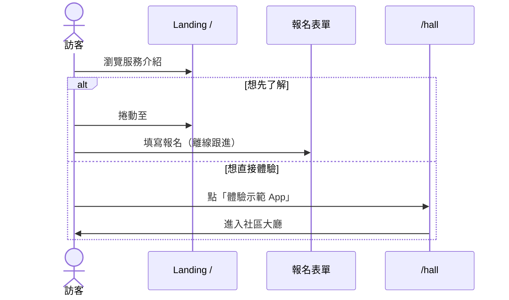

# Wireflow（線框流程圖）

**項目**：社區循環經濟與升級改造平台（社區換物 carousell）  
**版本**：1.0  
**對應實作**：Next.js App Router（`(marketing)` + `(app)`）  
**文件語言**：繁體中文（臺灣書面語）  
**相關文件**：[PRD.md](PRD.md)、[user-journey-map.md](user-journey-map.md)、[ux-design-kit.md](ux-design-kit.md)

> **Wireflow 是什麼？**  
> 結合 **Sitemap（資訊架構）**、**畫面線框（Wireframe）** 與 **導覽流程（User Flow）** 的單一文件。  
> 本文件依**目前程式碼實作**繪製，標示已建頁面、區塊與跳轉關係；規劃中但未實作的功能以虛線標記。  
> **高保真線框（Figma 規格）**：[wireflow-hifi.md](wireflow-hifi.md) · [瀏覽器預覽](wireframes/preview.html)

---

## 1. 系統總覽

平台分為兩個體驗區：

| 區域 | 路由群組 | 入口 | 用途 |
|------|----------|------|------|
| **行銷網站** | `(marketing)` | `/` | 服務介紹、報名登記、社區物品展示、模擬付款示範 |
| **街坊示範 App** | `(app)` | `/hall` | PWA 街坊端：活動、日程、積分、物品篩選、帳戶 |

```mermaid
flowchart TB
  subgraph marketing [行銷網站 /]
    LP[Landing Page 單頁多區塊]
  end

  subgraph app [街坊示範 App]
    BN[底部導覽 4 Tab]
    BN --> Hall[/hall 社區大廳]
    BN --> Market[/marketplace 物品篩選]
    BN --> Sched[/schedule 日程]
    BN --> Acct[/account 帳戶]
  end

  LP -->|體驗示範 App| Hall
  Acct -->|返回平台首頁| LP

  Hall --> Explore[/explore 探索活動]
  Explore --> Detail[/explore/id 活動詳情]
  Sched --> Detail
  Hall --> Detail

  Hall --> Wallet[/wallet 儲分與兌換]
  Acct --> Wallet
  Acct --> Reg[/account/registrations]
  Acct --> Set[/account/settings]
  Detail --> Reg
```

---

## 2. 完整 Sitemap

```
/  （行銷 Landing）
├── #hero              Hero 主視覺
├── #intro             服務介紹、服務對象
├── #idea              理念與三大支柱
├── #features          核心功能
├── #app-preview       App 預覽
├── #marketplace       社區物品篩選（行銷版）
├── #comparison        同類服務比較
├── #comments          留言板
├── #join              加入我們（報名表單）
└── #payment-session   模擬付款閘道

/hall                  社區大廳（App 首頁）
/explore               探索活動列表
/explore/[id]          活動詳情 + 報名
/marketplace           社區物品篩選（App 版）
/schedule              我的日程（月曆 + 即將舉行）
/wallet                儲分與兌換
/wallet?tab=earn       儲分與兌換（賺分 Tab）
/account               帳戶總覽
/account/registrations 活動報名紀錄
/account/settings      設定
```

**底部導覽（固定 4 Tab）**：主頁 `/hall` · 物品篩選 `/marketplace` · 日程 `/schedule` · 帳戶 `/account`

> `/wallet` 與 `/explore` **不在**底部導覽，透過快捷按鈕、帳戶選單或內容連結進入。

---

## 3. 行銷網站 Wireflow

### 3.1 頁面結構（單頁捲動）

```mermaid
flowchart TD
  Nav[LandingNav 固定頂部]
  Nav --> Hero
  Hero --> Intro[ServiceIntro + TargetAudience]
  Intro --> Idea[IdeaSection]
  Idea --> Features[CoreFeaturesSection]
  Features --> Preview[AppPreviewSection]
  Preview --> MarketLP[ItemMarketplace]
  MarketLP --> Compare[ComparisonSection]
  Compare --> Comments[CommentBoard]
  Comments --> Join[JoinSection + RegistrationForm]
  Join --> Payment[MockPaymentGateway]
  Payment --> Footer[LandingFooter]

  Nav -->|錨點| Features
  Nav -->|錨點| Preview
  Nav -->|錨點| MarketLP
  Nav -->|錨點| Join
  Nav -->|錨點| Payment
  Nav -->|體驗示範 App| HallApp[/hall]
```

### 3.2 各區塊線框摘要

#### `/` — Hero

```
┌─────────────────────────────────────┐
│ [Logo] 社區換物carousell    [體驗App]│
├─────────────────────────────────────┤
│  主標題 + 副標（循環經濟、長者友善） │
│  [CTA：了解服務] [CTA：體驗示範 App]  │
│  ┌──────────────┐                   │
│  │  主視覺圖片   │                   │
│  └──────────────┘                   │
└─────────────────────────────────────┘
```

#### `#join` — 加入我們（報名流程）

```
┌──────────────────┬──────────────────┐
│ 步驟 01–03 說明   │  RegistrationForm │
│ 填表 → 電話跟進   │  姓名* 電話*       │
│ → 安排見面        │  地區  興趣活動     │
│                  │  留言              │
│                  │  [提交登記]        │
└──────────────────┴──────────────────┘
         │
         ▼ 提交成功
┌─────────────────────────────────────┐
│ ✓ 已收到登記（示範，無後端）          │
│   3 個工作天內電話聯絡               │
└─────────────────────────────────────┘
```

#### `#payment-session` — 模擬付款（示範）

```
┌─────────────────────────────────────┐
│ 模擬付款閘道（教學／示範用）          │
│ 金額、付款方式選擇                    │
│ [確認付款] → 成功／失敗狀態           │
└─────────────────────────────────────┘
```

### 3.3 行銷 → App 轉換流程



---

## 4. 街坊示範 App Wireflow

### 4.1 全域殼層（AppShell）

```
┌─────────────────────────────────────┐
│           頁面內容區                  │
│         （max-w-lg 置中）             │
│                                     │
├─────────────────────────────────────┤
│ 🏠主頁 │ 🔍物品篩選 │ 📅日程 │ 👤帳戶 │  ← BottomNav 固定
└─────────────────────────────────────┘
```

### 4.2 `/hall` — 社區大廳

```
┌─────────────────────────────────────┐
│ 你好，{會員名}                        │
│ 社區大廳                              │
├─────────────────────────────────────┤
│ 即將舉行的活動（最多 3 筆預覽）        │
│ ┌─────────────────────────────────┐ │
│ │ [最近] 活動卡 → /explore/[id]    │ │
│ └─────────────────────────────────┘ │
│ [顯示更多活動 → /explore]            │
├─────────────────────────────────────┤
│ 快捷功能                              │
│ [掃碼賺分 → /wallet?tab=earn]        │
│ [尋找修繕師傅 → /explore]            │
│ [上傳閒置物品 → /marketplace]        │
└─────────────────────────────────────┘
```

### 4.3 `/explore` — 探索活動

```
┌─────────────────────────────────────┐
│ ← /hall    探索活動          [篩選🔧] │
│ 探索全部 N 個活動                     │
├─────────────────────────────────────┤
│ ┌ ActivityCard ────────────────────┐ │
│ │ 封面圖 · 月份標籤 · ♡收藏        │ │
│ │ 標題 · 日期 · 地點 · 名額        │ │
│ │ → /explore/[id]                  │ │
│ └──────────────────────────────────┘ │
│ （列表重複）                          │
└─────────────────────────────────────┘
```

### 4.4 `/explore/[id]` — 活動詳情

```
┌─────────────────────────────────────┐
│ ← /explore   活動詳情                 │
├─────────────────────────────────────┤
│ ┌ 封面圖 + 月份標籤 + ♡ ────────────┐ │
│ │ 代碼 · 標題 · 主辦單位             │ │
│ │ 📅 日期  🕐 時間  📍 地點          │ │
│ │ 🏢 報名方式  👥 尚餘名額            │ │
│ │ [活動簡介]                         │ │
│ │ 參加對象                           │ │
│ └───────────────────────────────────┘ │
│ [立即報名（示範）]                    │
└─────────────────────────────────────┘
         │ 點擊報名
         ▼
┌─────────────────────────────────────┐
│ Modal：報名成功 / 已報名              │
│ [查看報名紀錄 → /account/registrations]│
│ [關閉]                               │
└─────────────────────────────────────┘
```

### 4.5 `/schedule` — 我的日程

```
┌─────────────────────────────────────┐
│ 我的日程                              │
├─────────────────────────────────────┤
│ MonthCalendar（點日期篩選當日活動）    │
│ 圖例：●交換 ●修繕 ●工作坊             │
│ 瀏覽全部活動 → /explore              │
├─────────────────────────────────────┤
│ 即將舉行（或選定日期活動）             │
│ 活動列 → /explore/[id]               │
└─────────────────────────────────────┘
```

### 4.6 `/marketplace` — 社區物品篩選

```
┌─────────────────────────────────────┐
│ 社區物品篩選                          │
│ 試用分類與搜尋，瀏覽街坊分享的舊物故事  │
├─────────────────────────────────────┤
│ [🔍 搜尋]  [分類▼]  [狀況▼]          │
├─────────────────────────────────────┤
│ ItemCard × N                         │
│ emoji · 標題 · 分類 · 狀況            │
│ 物品故事 · 提供者                     │
│ （手機預設顯示 3 筆，可展開全部）       │
└─────────────────────────────────────┘
```

### 4.7 `/wallet` — 儲分與兌換

```
┌─────────────────────────────────────┐
│ SiteHeader：儲分與兌換                  │
│ PointsWalletCard（大字結餘）           │
├─────────────────────────────────────┤
│ Tab：[兌換] | [賺分]                  │
├─────────────────────────────────────┤
│ 【兌換 Tab — 預設】                   │
│ 可用積分：{balance}                   │
│ 兌換服務／物品列表                     │
│   每項：標題 · 分類 · 說明 · 積分 · [兌換]│
│ 已兌換紀錄                            │
├─────────────────────────────────────┤
│ 【賺分 Tab — ?tab=earn】              │
│ 點樣賺積分？（掃碼／交換／修繕／參觀）  │
│ 最近積分流水                          │
└─────────────────────────────────────┘
```

### 4.8 `/account` — 帳戶

```
┌─────────────────────────────────────┐
│ 😊 頭像  姓名                         │
│        社區編號 · 電話                 │
├─────────────────────────────────────┤
│ HomeBalance（積分結餘卡）              │
├─────────────────────────────────────┤
│ 活動報名紀錄（摘要）→ 全部             │
├─────────────────────────────────────┤
│ 選單                                  │
│ · 儲分與兌換        → /wallet          │
│ · 積分紀錄          → /wallet?tab=earn│
│ · 活動報名紀錄      → /account/registrations│
│ · 設定              → /account/settings│
│ · 返回平台首頁      → /               │
└─────────────────────────────────────┘
```

### 4.9 子頁面

| 路由 | 線框重點 |
|------|----------|
| `/account/registrations` | ← 返回帳戶；完整報名紀錄列表 |
| `/account/settings` | ← 返回帳戶；帳戶資料與偏好（示範） |

---

## 5. 核心使用者流程

### 5.1 流程 A：瀏覽並報名活動

**Persona**：陳婆婆（或家人代操作）  
**目標**：找到本月換物日並完成報名

```mermaid
flowchart LR
  A[/hall] -->|活動卡或顯示更多| B[/explore]
  A -->|快捷：尋找修繕師傅| B
  C[/schedule] -->|活動列| D[/explore/id]
  B -->|ActivityCard| D
  A -->|活動預覽卡| D
  D -->|立即報名| E{已報名?}
  E -->|否| F[成功 Modal]
  E -->|是| G[已報名 Modal]
  F --> H[/account/registrations]
  G --> H
```

| 步驟 | 畫面 | 使用者動作 | 系統回應 |
|------|------|------------|----------|
| 1 | `/hall` | 查看即將舉行活動 | 顯示最多 3 筆預覽 |
| 2 | `/explore` 或直達 | 選擇活動 | 進入詳情頁 |
| 3 | `/explore/[id]` | 閱讀簡介、名額 | 顯示完整資訊 |
| 4 | 同上 | 點「立即報名」 | Context 寫入；顯示 Modal |
| 5 | Modal | 查看報名紀錄 | 導向 `/account/registrations` |

---

### 5.2 流程 B：賺分與兌換

**Persona**：陳婆婆  
**目標**：了解如何賺積分，並兌換社區禮品

```mermaid
flowchart LR
  A[/hall] -->|掃碼賺分| B[/wallet?tab=earn]
  C[/account] -->|儲分與兌換| D[/wallet]
  C -->|積分紀錄| B
  D -->|Tab 切換| E[兌換 Tab]
  D -->|Tab 切換| F[賺分 Tab]
  F --> G[賺分方式說明 + 流水]
  E -->|點兌換| H[扣減積分 + 成功提示]
```

| 步驟 | 畫面 | 使用者動作 | 系統回應 |
|------|------|------------|----------|
| 1 | `/wallet` | 查看結餘 | PointsWalletCard 大字顯示 |
| 2 | 賺分 Tab | 閱讀賺分方式 | 靜態說明 + 示範流水 |
| 3 | 兌換 Tab | 選擇禮品並兌換 | `redeem()` 扣點；5 秒提示 |
| 4 | 兌換 Tab | 查看已兌換紀錄 | 列表顯示歷史 |

---

### 5.3 流程 C：瀏覽社區物品

**Persona**：街坊、義工  
**目標**：依分類或關鍵字找到可交換物品

```mermaid
flowchart LR
  A[/hall] -->|上傳閒置物品| B[/marketplace]
  BN[底部導覽] --> B
  LP[#marketplace] -.行銷版.-> B
  B --> C[搜尋 / 分類 / 狀況篩選]
  C --> D[ItemCard 列表]
```

> **備註**：行銷頁 `#marketplace` 與 App `/marketplace` 共用 `CommunityItemFilter` 元件，資料來自 `landingData.ts`。

---

### 5.4 流程 D：首次訪客完整路徑（端到端）

```mermaid
flowchart TD
  Start((訪客)) --> LP[/ 行銷首頁]
  LP --> Choice{意圖}
  Choice -->|想報名線下跟進| Form[#join 表單]
  Form --> Phone[職員／義工電話跟進]
  Phone --> Offline[線下交換日 J-A]
  Choice -->|想先試 App| Hall[/hall]
  Hall --> Act[探索／報名活動]
  Hall --> Points[積分賺取／兌換]
  Hall --> Items[物品篩選]
  Offline -.可選.-> Hall
```

---

### 5.5 流程 E：義工代操作（規劃中 · 未實作 UI）

依 [PRD.md](PRD.md) 與 [user-journey-map.md](user-journey-map.md) J-C 旅程，長者可全程不開 App，由義工在**中心後台**代報名／代登記。街坊端 Wireflow 以虛線標示未來對應：

```mermaid
flowchart LR
  subgraph offline [線下／後台 規劃中]
    Admin[中心後台]
    Paper[紙本積分卡]
  end
  subgraph app [街坊 App 現況]
    Acct[/account]
    Wallet[/wallet]
  end
  Volunteer[義工] --> Admin
  Admin -.同步.-> Acct
  Admin --> Paper
  Elder[長者] --> Paper
  Elder -.可選.self App
  Elder --> Acct
```

---

## 6. 畫面狀態與互動備註

| 元件／行為 | 狀態 | 備註 |
|------------|------|------|
| 活動報名 | 示範 | `ActivityRegistrationsContext` 記憶於 session |
| 積分兌換 | 示範 | `PointsContext` 記憶於 session |
| 活動收藏 ♡ | 示範 | 元件內 `useState`，不持久化 |
| 探索活動篩選按鈕 | UI only | 尚未接篩選邏輯 |
| 報名表單 | 示範 | 前端驗證後顯示成功，無 API |
| 模擬付款 | 示範 | 教學用，非真實金流 |

---

## 7. 導覽矩陣

| 從 \ 到 | `/` | `/hall` | `/explore` | `/explore/[id]` | `/marketplace` | `/schedule` | `/wallet` | `/account` | `/account/*` |
|---------|:---:|:-------:|:----------:|:---------------:|:--------------:|:-----------:|:---------:|:----------:|:------------:|
| LandingNav | — | ✓ | | | 錨點 | | | | |
| BottomNav | | ✓ | | | ✓ | ✓ | | ✓ | |
| `/hall` 快捷 | | — | ✓ | ✓ | ✓ | | ✓ | | |
| `/hall` 活動 | | | ✓ | ✓ | | | | | |
| `/account` 選單 | ✓ | | | | | | ✓ | — | ✓ |
| `/schedule` | | | ✓ | ✓ | | — | | | |
| 活動詳情 Modal | | | | — | | | | | ✓ |

---

## 8. 與 PRD 對照

| PRD 一期 MVP（街坊端） | Wireflow 對應 | 狀態 |
|------------------------|---------------|------|
| 查積分（大字結餘） | `/wallet`、`HomeBalance`、`PointsWalletCard` | ✓ 示範 |
| 睇活動（本月主題、地點、時間） | `/hall`、`/explore`、`/schedule` | ✓ 示範 |
| 報名 | `/explore/[id]` | ✓ 示範 |
| 義工代操作 | 中心後台（未實作） | ○ 規劃 |
| 紙本備用 | 線下流程 | ○ 營運 SOP |

---

## 9. 修訂紀錄

| 版本 | 日期 | 說明 |
|------|------|------|
| 1.0 | 2026-06-17 | 初版：依現行 `(marketing)` + `(app)` 路由與元件建立 |
