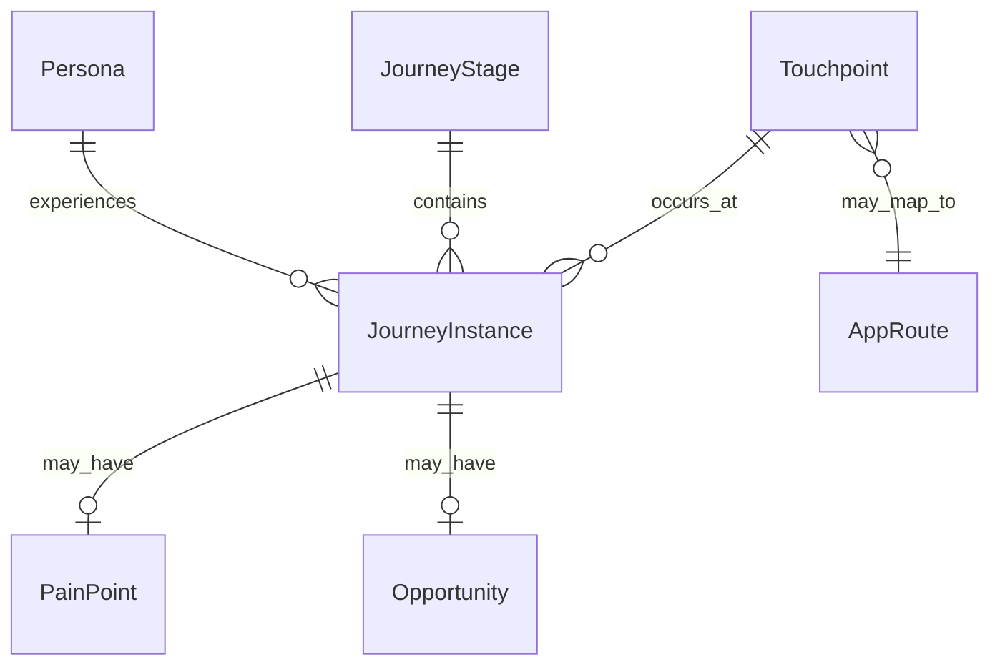

# Data Model: 用戶體驗地圖實體

**Feature**: 001-ux-journey-map  
**Date**: 2026-06-20

## Entity Relationship



## Entities

### Persona（角色）

| Field | Type | Description | Validation |
|-------|------|-------------|------------|
| id | string | 唯一代號，如 `P1-elder` | required, kebab-case |
| name | string | 顯示名稱，如「長者陳姨」 | required |
| priority | enum | P1 / P2 / P3 | required |
| description | string | 角色背景與需求摘要 | required |
| constraints | string[] | 特殊限制（如行動不便、不會用 App） | optional |

**Instances**:

| id | name | priority |
|----|------|----------|
| P1-elder | 長者陳姨 | P1 |
| P2-first-timer | 街坊阿明 | P1 |
| P3-active-trader | 換取方李姐 | P2 |
| P4-volunteer | 義工阿珍 | P2 |
| P5-visitor | 訪客何太 | P3 |

---

### JourneyStage（旅程階段）

| Field | Type | Description | Validation |
|-------|------|-------------|------------|
| order | int | 階段序號 1–7 | required, unique |
| name_zh | string | 中文名稱 | required |
| name_en | string | 英文名稱 | required |
| goal | string | 街坊在此階段的目標 | required |

**Instances**:

| order | name_zh | name_en |
|-------|---------|---------|
| 1 | 認知 | Awareness |
| 2 | 考量 | Consideration |
| 3 | 準備 | Preparation |
| 4 | 線上參與 | Online Engagement |
| 5 | 線下換物市集 | Offline Market |
| 6 | 持續參與 | Retention |
| 7 | 倡導 | Advocacy |

---

### Touchpoint（觸點）

| Field | Type | Description | Validation |
|-------|------|-------------|------------|
| id | string | 唯一代號 | required |
| name | string | 觸點名稱 | required |
| channel | enum | marketing / app / offline / volunteer | required |
| route | string | App 路由或實體位置 | optional |
| prd_stories | int[] | 對應 PRD 用戶故事編號 | optional |
| demo_status | enum | implemented / mock / not_implemented | required for app channel |

**Key App Touchpoints**:

| id | name | route | demo_status |
|----|------|-------|-------------|
| TP-LANDING | 行銷落地頁 | `/` | implemented |
| TP-HALL | 社區大廳 | `/hall` | implemented |
| TP-EXPLORE | 探索活動 | `/explore` | implemented |
| TP-EXPLORE-DETAIL | 活動詳情 | `/explore/[id]` | implemented |
| TP-SCHEDULE | 日程月曆 | `/schedule` | implemented |
| TP-MARKETPLACE | 線上換物 | `/marketplace` | implemented |
| TP-UPLOAD | 上傳物品 | `/marketplace/upload` | implemented |
| TP-WALLET | 積分錢包 | `/wallet` | implemented |
| TP-ACCOUNT | 帳戶 | `/account` | implemented |
| TP-REGISTRATIONS | 報名紀錄 | `/account/registrations` | implemented |
| TP-SETTINGS | 帳戶設定 | `/account/settings` | implemented |

**Key Offline Touchpoints**:

| id | name | channel |
|----|------|---------|
| TP-SWAP-STALL | 換物攤 | offline |
| TP-REPAIR-STALL | 維修攤 | offline |
| TP-DIGITAL-STALL | 數碼義診攤 | offline |
| TP-STORAGE | 合作暫存點 | offline |
| TP-ESTATE-POSTER | 屋邨宣傳海報 | marketing |

---

### JourneyInstance（旅程實例）

單一角色在單一階段的體驗記錄。

| Field | Type | Description | Validation |
|-------|------|-------------|------------|
| persona_id | string | FK → Persona | required |
| stage_order | int | FK → JourneyStage | required |
| actions | string[] | 街坊行動 | required |
| touchpoint_ids | string[] | FK → Touchpoint | required |
| thoughts | string | 內心想法（第一人稱） | required |
| emotion | enum | positive / neutral / negative | required |
| pain_points | string[] | 痛點 | optional |
| opportunities | string[] | 設計機會 | optional |

---

### PainPoint（痛點）

| Field | Type | Description |
|-------|------|-------------|
| id | string | 唯一代號 |
| description | string | 痛點描述 |
| severity | enum | high / medium / low |
| affected_personas | string[] | 影響角色 |

**Cross-cutting Pain Points**:

| id | description | severity | affected_personas |
|----|-------------|----------|-------------------|
| PP-APP-BARRIER | 不熟悉 App 操作 | high | P1-elder, P2-first-timer |
| PP-MOBILITY | 行動不便難以搬運物品 | high | P1-elder |
| PP-POINTS-CONFUSION | 不理解積分規則 | medium | P2-first-timer, P5-visitor |
| PP-WAIT-TIME | 維修／數碼攤排隊久 | medium | P1-elder, P3-active-trader |
| PP-REPAIR-DELAY | 留件需等下次市集 | medium | P1-elder |

---

### Opportunity（機會）

| Field | Type | Description |
|-------|------|-------------|
| id | string | 唯一代號 |
| description | string | 改善建議 |
| priority | enum | high / medium / low |
| touchpoint_ids | string[] | 相關觸點 |

**High-Priority Opportunities**:

| id | description | priority |
|----|-------------|----------|
| OP-VOLUNTEER-ASSIST | 強化義工代操作可見性與引導 | high |
| OP-TRIAL-VISIT | 試水溫參觀路徑在 App 與落地頁更突出 | high |
| OP-POINTS-ONBOARD | 首次使用積分錢包時的圖文教學 | high |
| OP-PRIORITY-QUEUE | 已報名者排隊優先狀態可視化 | medium |
| OP-STORAGE-TRACK | 留件追蹤狀態查詢（未來功能） | medium |

---

## State Transitions

### 物品生命週期（對照觸點）

```
draft → pending_review → published → reserved → handed_off
         ↑ 觸點: TP-UPLOAD    ↑ TP-MARKETPLACE  ↑ TP-SWAP-STALL
```

### 街坊參與度（階段流轉）

```
Awareness → Consideration → Preparation → Online Engagement → Offline Market → Retention → Advocacy
                                                                              ↓
                                                                    (循環回 Preparation)
```

### 積分狀態（錢包觸點）

```
earn（報到、帶物、試水溫）→ balance → spend（預約、兌換）→ settle（交收結算）
```

## Validation Rules

1. 每個 `JourneyInstance` 必須至少關聯一個 `Touchpoint`
2. `app` 通道觸點必須標註 `demo_status`
3. 所有 `Touchpoint.name` 必須通過 CONTEXT.md 詞彙稽核
4. `Offline Market` 階段必須涵蓋三攤觸點（換物攤、維修攤、數碼義診攤）
