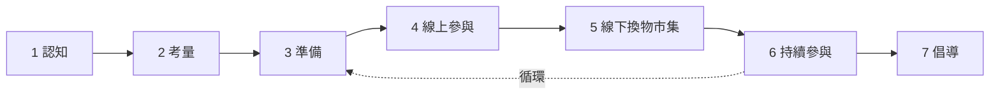
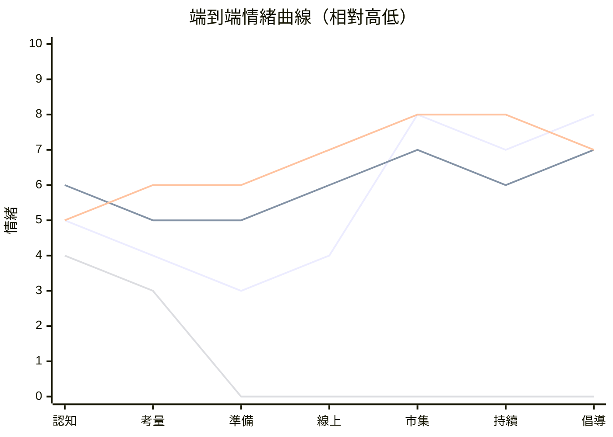
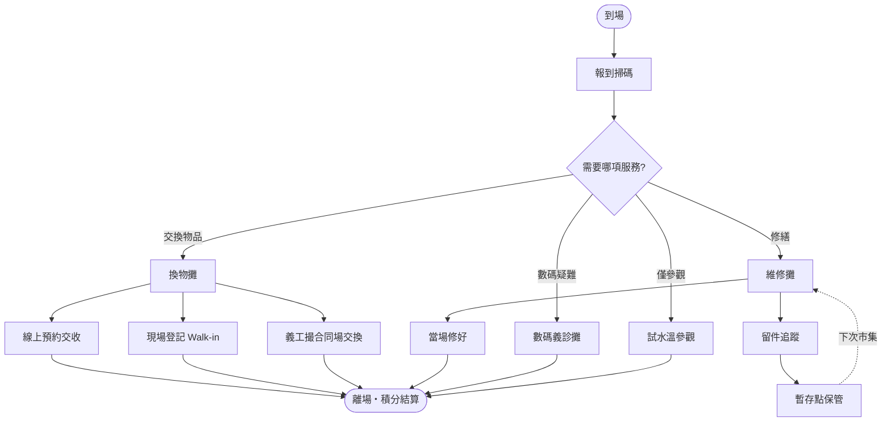

# 用戶體驗地圖 — 社區換物 Carousell

**Feature**: 001-ux-journey-map  
**版本**: 1.0  
**日期**: 2026-06-20  
**文件語言**: 繁體中文（臺灣書面語）  
**對應文件**: [spec.md](./spec.md)、[CONTEXT.md](../../CONTEXT.md)、[PRD](../../.scratch/community-sweep-platform/PRD.md)

---

## 一、總覽

### 1.1 服務定位

社區換物 Carousell 以**每月換物市集**為核心，結合**線上 App 媒合**與**社區感謝積分**，服務香港街坊（優先關注長者）的物資循環與鄰里連結需求。

**體驗設計原則**：
- 線上媒合、現場交收（ADR-0001）
- 實體為主：唔識用 App 亦有義工幫手
- 低門檻：Walk-in、試水溫參觀均可
- 長者友善：大字、暖色、大觸控區

### 1.2 旅程階段



### 1.3 角色一覽

| 代號 | 角色 | 優先級 | 一句話描述 |
|------|------|--------|------------|
| P1 | 長者陳姨 | P1 | 行動不便、居家囤積、需義工全程協助 |
| P2 | 街坊阿明 | P1 | 首次聽聞、觀望中、可先試水溫參觀 |
| P3 | 換取方李姐 | P2 | 熟悉 App、積極預約、定期參與換物 |
| P4 | 義工阿珍 | P2 | 現場登記、審核定分、撮合同場交換 |
| P5 | 訪客何太 | P3 | 僅看過落地頁、尚未決定是否參與 |

---

## 二、情緒曲線摘要



| 角色 | 情緒最低點 | 情緒最高點 | 關鍵轉折 |
|------|------------|------------|----------|
| P1 長者陳姨 | 準備（不知如何整理） | 線下市集（有人幫手、交到朋友） | 義工代操作消除 App 障礙 |
| P2 街坊阿明 | 考量（怕尷尬、怕帶錯物品） | 線下市集（試水溫獲歡迎積分） | 試水溫參觀降低承諾 |
| P3 換取方李姐 | 認知（不知有這服務） | 持續參與（積分循環、定期換物） | 預約成功 → 現場交收閉環 |
| P5 訪客何太 | 考量（資訊太多、不知從何入手） | —（尚未進入後段） | 落地頁 CTA 與 FAQ |

---

## 三、完整旅程矩陣

### 階段 1：認知（Awareness）

| 維度 | P1 長者陳姨 | P2 街坊阿明 | P3 換取方李姐 | P5 訪客何太 |
|------|-------------|-------------|---------------|-------------|
| **行動** | 經過屋邨大堂見到宣傳；聽鄰居提起換物市集 | 聽朋友講試水溫參觀；見海報寫「不帶物也可參觀」 | 社區中心通告得知 | 搜尋「社區換物」找到落地頁 |
| **觸點** | 🏘 屋邨宣傳海報 · 👥 鄰居口碑 | 👥 朋友口碑 · 🏘 屋邨宣傳海報 | 🏘 社區中心通告 · 📱 App 商店（未來） | 🌐 落地頁 `/` |
| **想法** | 「又有社區活動？我屋企啲舊嘢點算好？」 | 「試水溫參觀？唔使帶嘢都得？」 | 「終於有個唔使畀錢買嘢嘅地方」 | 「同 Carousell 有咩分別？」 |
| **情緒** | 😐 中性（好奇但卻步） | 😊 正向（有興趣） | 😊 正向 | 😐 中性 |
| **痛點** | 唔知啱唔啱自己；驚體力頂唔順 | 以為一定要帶物品先可以參加 | — | 與商業平台混淆 |
| **機會** | 海報強調「義工幫手」 | 試水溫參觀 | — | 落地頁競品對照區塊 |

---

### 階段 2：考量（Consideration）

| 維度 | P1 長者陳姨 | P2 街坊阿明 | P3 換取方李姐 | P5 訪客何太 |
|------|-------------|-------------|---------------|-------------|
| **行動** | 請家人幫忙了解詳情；致電社區中心查詢 | 查閱落地頁試水溫說明；比較參觀同正式參與的分別 | 瀏覽線上換物物品清單評估吸引力 | 閱讀核心理念、App 預覽、FAQ |
| **觸點** | 📱 `/hall`（家人代開）· 🌐 `/` · ☎️ 社區中心 | 🌐 `/` `#faq` · 📱 `/explore` | 📱 `/marketplace` · 🌐 `/` | 🌐 `/` · `#faq` · `#app-preview` |
| **想法** | 「使唔使帶嘢？我行路唔方便，點算？」 | 「不如先試水溫，下次再帶嘢換都唔遲」 | 「有幾件嘢幾啱我，要幾多積分？」 | 「積分係咩？可唔可以換錢？」 |
| **情緒** | 😟 負向（擔心體力、尷尬） | 😐 中性（觀望） | 😊 正向 | 😟 負向（資訊焦慮） |
| **痛點** | 行動不便；唔想累住家人 | 唔清楚試水溫可以獲幾多積分 | 積分規則初次理解成本 | 積分 vs 港元混淆 |
| **機會** | 義工電話熱線 | 試水溫參觀 CTA 置頂 | 類別分值表在換物頁可見 | 落地頁「積分不可兌現金」醒目提示 |

---

### 階段 3：準備（Preparation）

| 維度 | P1 長者陳姨 | P2 街坊阿明 | P3 換取方李姐 | P4 義工阿珍 |
|------|-------------|-------------|---------------|-------------|
| **行動** | 在家整理 1–3 件物品；請家人協助 App 上架或報名 | App 選擇試水溫參觀並報名；記低換物市集日期 | 上傳閒置物品；報名換物市集；預約他人物品 | 提前熟悉類別分值表；準備現場登記表格 |
| **觸點** | 📱 `/marketplace/upload` · `/explore/[id]` 報名 · 🤝 家人代操作 · 🏘 上門收物（營運流程） | 📱 `/explore/[id]` 報名 · `/account/registrations` | 📱 `/marketplace/upload` · `/marketplace` 預約 · `/explore/[id]` | 📋 內部培訓 · 📱 義工版（未來） |
| **想法** | 「呢件衫放咗好多年，唔知有冇人要」 | 「報咗試水溫，到時去睇流程就得」 | 「上傳等審核，順便預約嗰個花瓶」 | 「今次 Walk-in 人數要預留彈性」 |
| **情緒** | 😟→😐（整理有壓力但有人幫） | 😊 正向（有明確下一步） | 😊 正向 | 😐 中性 |
| **痛點** | 不知哪些物品適合帶；上架表單欄位多 | 唔熟 App 報名操作 | 審核等待時間不確定 | 示範版無義工後台 |
| **機會** | 電話熱線諮詢 | 報名成功 modal 說明試水溫選項 | 上架後「等候審核」狀態清晰 | 現場紙本登記備援 |

**物品狀態流轉（準備階段）**：
```
上傳 → 等候義工審核 → 核定積分 → 公開上架
```

---

### 階段 4：線上參與（Online Engagement）

| 維度 | P1 長者陳姨 | P2 街坊阿明 | P3 換取方李姐 |
|------|-------------|-------------|---------------|
| **行動** | 查看報名紀錄；瀏覽日程確認日期；家人代為預約物品 | 查看日程；瀏覽換物物品「物色」 | 篩選類別；以積分預約；管理錢包餘額 |
| **觸點** | 📱 `/schedule` · `/account/registrations` · `/wallet` · 🤝 家人代操作 | 📱 `/schedule` · `/marketplace` · `/hall` | 📱 `/marketplace` · `/wallet?tab=earn` · `/wallet?tab=redeem` |
| **想法** | 「下星期六係咪有換物市集？」 | 「原來有咁多嘢可以換」 | 「積分夠唔夠預約嗰個鍾？」 |
| **情緒** | 😐 中性（依賴家人） | 😊 正向（發現有趣物品） | 😊 正向 |
| **痛點** | 無法獨立操作 App | 篩選選項多、不知怎麼選 | 已被預約物品撲空 |
| **機會** | 在場義工協助 | 大廳快捷入口「探索換物」 | 「已被預約」狀態即時顯示 |

---

### 階段 5：線下換物市集（Offline Market）★ 核心體驗



#### 5.1 換物攤

| 維度 | P1 長者陳姨 | P2 街坊阿明 | P3 換取方李姐 | P4 義工阿珍 |
|------|-------------|-------------|---------------|-------------|
| **行動** | 帶 2 件衣物；義工代登記定分；換到一個花瓶 | 試水溫參觀；獲歡迎積分；旁觀交換 | 交收預約的花瓶；帶物現場登記 | 核對預約、現場定分、撮合同場交換 |
| **觸點** | 🏪 換物攤 · 🤝 義工代登記 | 🏪 換物攤 · 🏪 試水溫登記處 | 🏪 換物攤 | 🏪 換物攤 · 📋 類別分值表 |
| **想法** | 「原來我啲舊衫都有人鍾意！」 | 「原來唔使帶嘢都有分，幾好」 | 「同網上睇到嘅一樣，交收好順」 | 「今日配對率幾高」 |
| **情緒** | 😊 正向（成就感） | 😊 正向（低壓力入門） | 😊 正向 | 😊 正向 |
| **痛點** | 排隊時體力不支 | — | — | 尖峰時段人手不足 |
| **機會** | 座椅休息區；義工引導動線 | 試水溫參觀徽章／歡迎卡 | 預約 QR 快速核對 | 尖峰預排班 |

#### 5.2 維修攤

| 維度 | P1 長者陳姨 | P2 街坊阿明 | P3 換取方李姐 |
|------|-------------|-------------|---------------|
| **行動** | 帶電風扇維修；當場修不好 → 留件追蹤 | — | 已報名優先排隊；修好一把椅子 |
| **觸點** | 🏪 維修攤 · 🏪 暫存點（留件） | — | 🏪 維修攤 |
| **想法** | 「唔使即刻搬返屋企等，放喺社區中心就得」 | — | 「報咗名果然快啲」 |
| **情緒** | 😐→😊（留件有交代） | — | 😊 正向 |
| **痛點** | 留件後不知進度 | 未報名排隊久 | — |
| **機會** | 留件追蹤狀態查詢（未來 App 功能） | 報名優先說明在活動詳情更醒目 | 排隊進度顯示 |

#### 5.3 數碼義診攤

| 維度 | P1 長者陳姨 | P2 街坊阿明 |
|------|-------------|-------------|
| **行動** | 請義工教點用 WhatsApp 傳相；學識掃碼報到 | 學識自己 App 報名 |
| **觸點** | 🏪 數碼義診攤 | 🏪 數碼義診攤 |
| **想法** | 「原來撳呢度就得，唔使怕」 | 「下次可以自己報名」 |
| **情緒** | 😊 正向（能力感提升） | 😊 正向 |
| **痛點** | 排隊久（未報名） | — |
| **機會** | 已報名優先標籤；一對一預約時段（未來） | 數碼義診後引導至 App 教程 |

---

### 階段 6：持續參與（Retention）

| 維度 | P1 長者陳姨 | P2 街坊阿明 | P3 換取方李姐 |
|------|-------------|-------------|---------------|
| **行動** | 查看積分餘額；兌換環保袋；關注下次換物市集 | 從試水溫升級為帶物參與；查看日程 | 持續上架／預約；兌換社區禮品 |
| **觸點** | 📱 `/wallet` · `/schedule` · `/hall` | 📱 `/hall` · `/explore` · `/marketplace/upload` | 📱 `/wallet` · `/marketplace` · `/account/registrations` |
| **想法** | 「原來積分可以換環保袋；下個月再帶啲嘢」 | 「下次帶件玩具去換」 | 「已經變成每月習慣」 |
| **情緒** | 😊 正向 | 😊 正向 | 😊 正向 |
| **痛點** | 不知積分怎麼賺 | 忘記下次市集日期 | — |
| **機會** | 獲發紙本印花卡 | 大廳活動倒數＋一鍵加入日程 | 參與里程碑（未來） |

---

### 階段 7：倡導（Advocacy）

| 維度 | P1 長者陳姨 | P2 街坊阿明 | P3 換取方李姐 | P4 義工阿珍 |
|------|-------------|-------------|---------------|-------------|
| **行動** | 告訴鄰居「唔使識 App 都有人教」；分享物品故事 | 推薦朋友試水溫參觀 | 在社區群組分享換物經驗 | 成為資深義工；培訓新人 |
| **觸點** | 👥 鄰居口碑 · 🏪 換物市集故事角 | 👥 朋友口碑 · 🌐 落地頁 `#join` | 👥 社區群組 | 🏪 換物市集 · 📋 義工培訓 |
| **想法** | 「好開心，想叫隔離屋婆婆一齊」 | 「其實唔難，叫佢去睇吓先」 | 「比 Carousell 有人情味」 | 「見到長者笑好有滿足感」 |
| **情緒** | 😊 正向 | 😊 正向 | 😊 正向 | 😊 正向 |
| **痛點** | — | — | — | 義工培訓資源有限 |
| **機會** | — | 推薦獎勵積分（未來） | 街坊大使計畫 | 義工感謝狀 |

---

## 四、跨角色服務藍圖（簡化）

| 階段 | 線上 App | 線下市集 | 義工介入 | 關鍵銜接點 |
|------|----------|----------|----------|------------|
| 認知 | 落地頁 | 屋邨宣傳 | — | 海報 QR → 落地頁 |
| 考量 | FAQ、探索 | — | 社區中心解答 | 家人代開 App |
| 準備 | 上架、報名 | — | 代上架、家訪 | 上架 → 審核 → 公開 |
| 線上參與 | 預約、錢包 | — | — | 預約 → 現場交收 |
| 線下市集 | 掃碼報到 | 三攤體驗 | 全程引導 | **交收閉環** |
| 持續 | 錢包、日程 | — | — | 積分結算 |
| 倡導 | 加入意向表 | 故事分享 | 義工推薦 | 口碑循環 |

---

## 五、App 觸點路由索引

| 旅程階段 | 路由 | 頁面用途 | 示範版狀態 |
|----------|------|----------|------------|
| 認知 | `/` | 行銷落地頁 | ✅ 已實作 |
| 考量 | `/` `#faq` | 常見問題 | ✅ 已實作 |
| 考量 | `/compare` | 競品對照 | ✅ 已實作 |
| 準備 | `/marketplace/upload` | 上傳閒置物品 | ✅ mock 審核 |
| 準備 | `/explore/[id]` | 活動詳情與報名 | ✅ 已實作 |
| 線上參與 | `/marketplace` | 瀏覽與預約 | ✅ 已實作 |
| 線上參與 | `/schedule` | 日程月曆 | ✅ 已實作 |
| 線上參與 | `/wallet` | 積分錢包 | ✅ mock 兌換 |
| 線下市集 | `/hall` → 掃碼賺分 | 報到入口 | ✅ UI only |
| 持續 | `/account/registrations` | 報名紀錄 | ✅ 已實作 |
| 持續 | `/account/settings` | 大字模式等 | ✅ mock 偏好 |
| 倡導 | `/` `#join` | 加入意向 | ✅ 已實作 |

**示範版限制**（須在體驗說明中標示）：
- 上架待審 → localStorage mock
- 義工審核 → 無後台，前端模擬
- 積分扣款 → client state，無真實結算
- 推播提醒 → UI 開關 only

---

## 六、痛點與機會優先矩陣

| 優先級 | 痛點 | 機會 | 影響角色 | 建議負責 |
|--------|------|------|----------|----------|
| 🔴 P0 | 不熟悉 App 操作 | 義工代操作路徑在 App 與市集可見 | P1, P2 | 設計＋營運 |
| 🔴 P0 | 行動不便難以搬運 | 上門收物說明在 FAQ／活動詳情強化 | P1 | 營運 |
| 🔴 P0 | 積分規則不理解 | 錢包「獲得方式」圖文教學 | P2, P5 | 設計 |
| 🟡 P1 | 審核等待不確定 | 「等候審核」狀態＋預計時間（未來） | P3 | 開發 |
| 🟡 P1 | 維修／數碼攤排隊久 | 已報名優先狀態可視化 | P1, P3 | 設計＋營運 |
| 🟡 P1 | 留件進度不透明 | 留件追蹤查詢（未來 App） | P1 | 產品 |
| 🟢 P2 | 忘記下次市集 | 大廳倒數＋日程一鍵加入 | 全部 | 開發 |
| 🟢 P2 | 與商業平台混淆 | 落地頁競品對照更突出 | P5 | 行銷 |

---

## 七、PRD 用戶故事覆蓋率

| PRD 區塊 | 故事數 | 地圖覆蓋 | 備註 |
|----------|--------|----------|------|
| 服務願景與對象 | 5 | 5/5 ✅ | P1、P2 角色 |
| 換物市集（線下） | 9 | 9/9 ✅ | 階段 5 三攤 |
| 換物攤與積分 | 6 | 6/6 ✅ | 階段 3–5 |
| 線上換物 App | 9 | 9/9 ✅ | 階段 3–4 |
| 維修攤與留件 | 4 | 4/4 ✅ | 階段 5.2 |
| 數碼義診攤 | 2 | 2/2 ✅ | 階段 5.3 |
| App 大廳探索日程 | 5 | 5/5 ✅ | 階段 4 |
| App 積分錢包 | 4 | 4/4 ✅ | 階段 4、6 |
| 長者友善無障礙 | 4 | 4/4 ✅ | 跨階段 |
| 行銷落地頁 | 3 | 3/3 ✅ | 階段 1–2 |
| 營運與義工 | 4 | 4/4 ✅ | P4 角色 |
| 示範版技術 | 3 | 3/3 ✅ | 路由索引 |
| **合計** | **58** | **58/58 (100%)** | |

---

## 八、示範版走查腳本（30 分鐘）

### 腳本 A：長者陳姨（義工代操作路徑）

1. **認知**（3 min）：閱讀落地頁 Hero — 確認「義工幫手」文案
2. **準備**（5 min）：`/marketplace/upload` — 模擬上架；檢查表單標籤字級
3. **報名**（5 min）：`/explore` → 活動詳情 → 報名成功 modal
4. **線上**（5 min）：`/schedule` 確認日期；`/wallet` 查看餘額
5. **市集**（7 min）：想像換物攤交收 → 維修攤留件 → 數碼義診
6. **持續**（5 min）：`/hall` 大廳倒數；`/wallet` 兌換環保袋

### 腳本 B：街坊阿明（試水溫路徑）

1. **認知**（3 min）：落地頁 FAQ — 確認試水溫說明
2. **報名**（5 min）：`/explore` 報名（不帶物）
3. **市集**（10 min）：想像試水溫參觀 → 獲歡迎積分 → 旁觀交換
4. **升級**（7 min）：`/marketplace` 瀏覽 → 決定下次帶物
5. **倡導**（5 min）：`/join` 推薦朋友

---

## 九、相關圖表

| 圖表 | 路徑 |
|------|------|
| 線上線下總覽 | [docs/online-offline-activity-flow.md](../../docs/online-offline-activity-flow.md) |
| 上架到交收 | [docs/flows/neighbour-upload-to-handoff.md](../../docs/flows/neighbour-upload-to-handoff.md) |
| 流程圖 PNG | [docs/assets/flowcharts/](../../docs/assets/flowcharts/) |
| 高保真線框 | [docs/wireflow-hifi.md](../../docs/wireflow-hifi.md) |
| WCAG 報告 | [docs/elderly-accessibility-wcag-report.md](../../docs/elderly-accessibility-wcag-report.md) |
| **HTML 視覺版** | [figma-export/html/ux-journey-map.html](./figma-export/html/ux-journey-map.html) |
| **Figma SVG** | [figma-export/svg/](./figma-export/svg/) · [匯入指南](./figma-export/figma-import-guide.md) |

---

## 十、版本紀錄

| 版本 | 日期 | 變更 |
|------|------|------|
| 1.0 | 2026-06-20 | 初版：5 角色 × 7 階段完整矩陣 |
